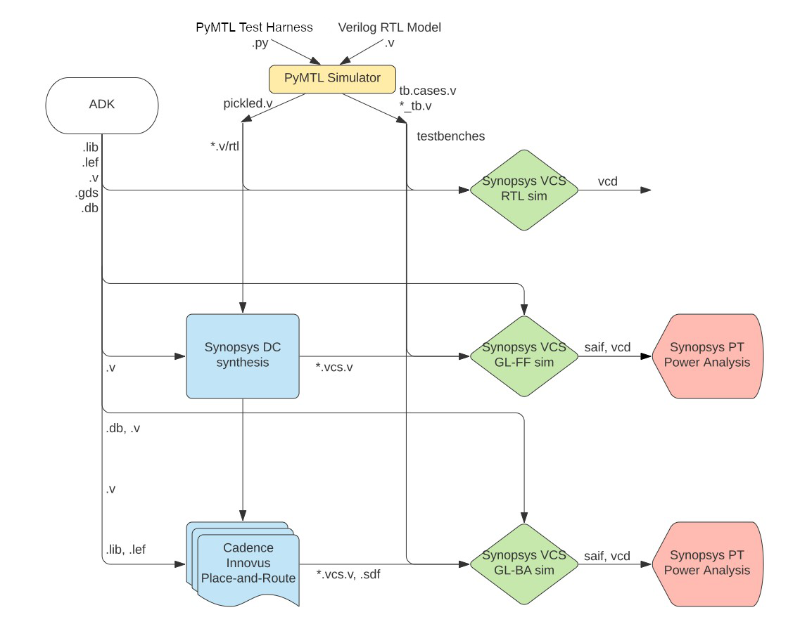
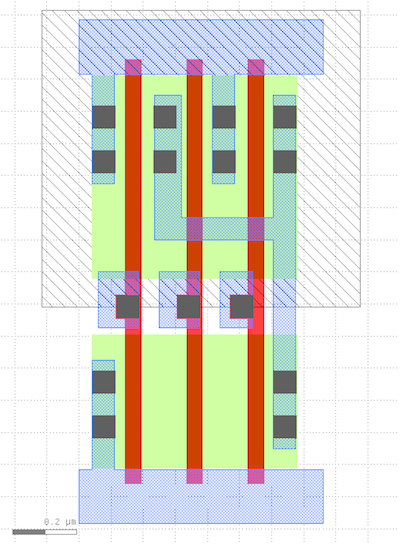
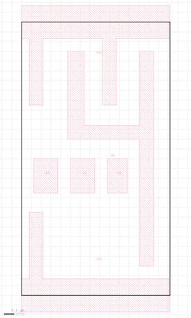
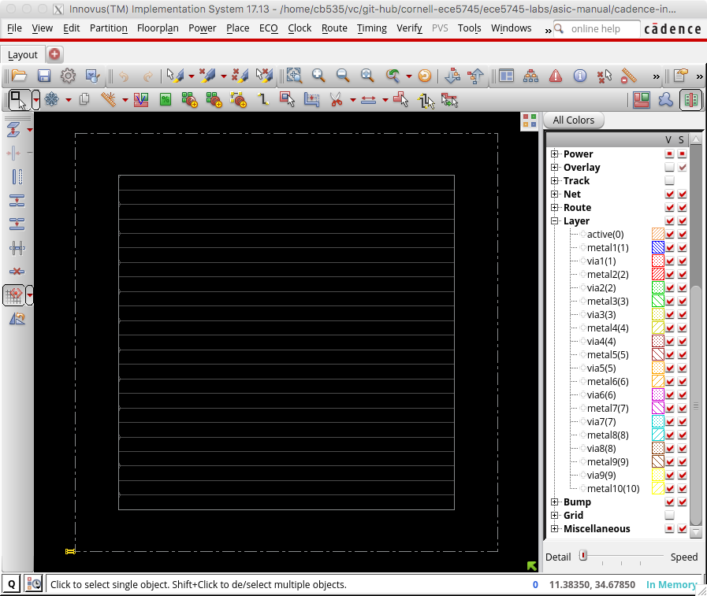
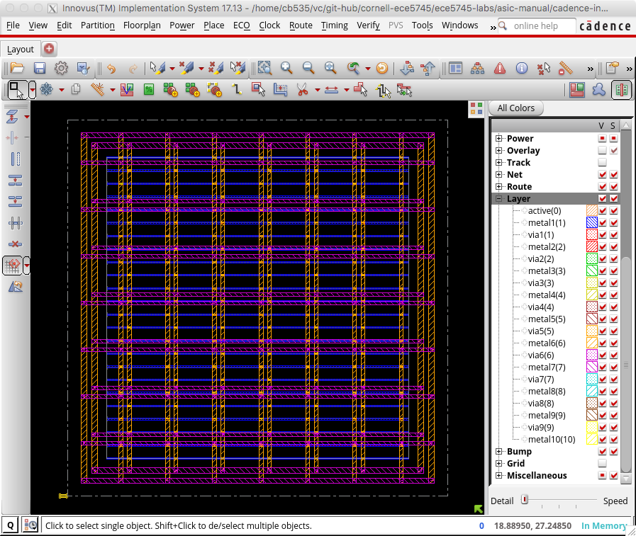
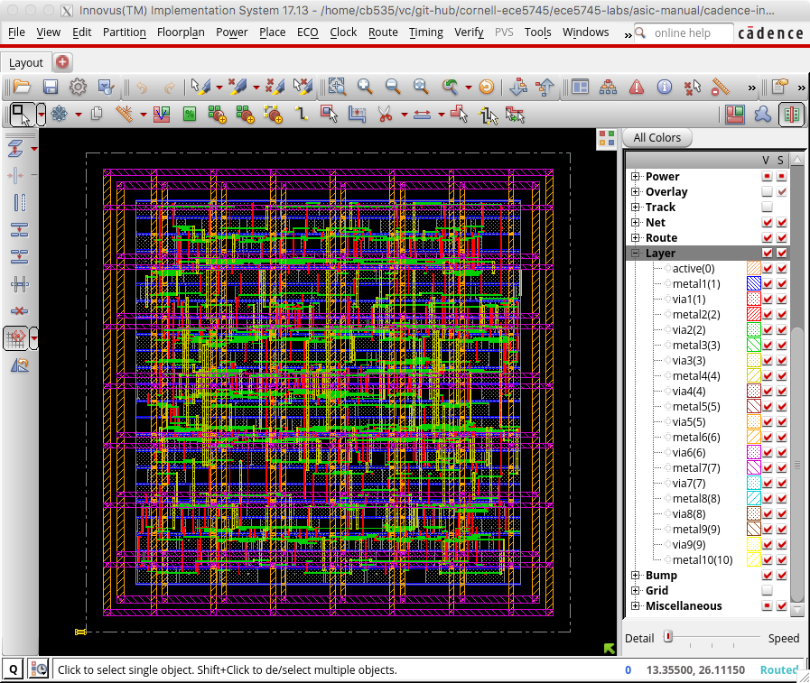
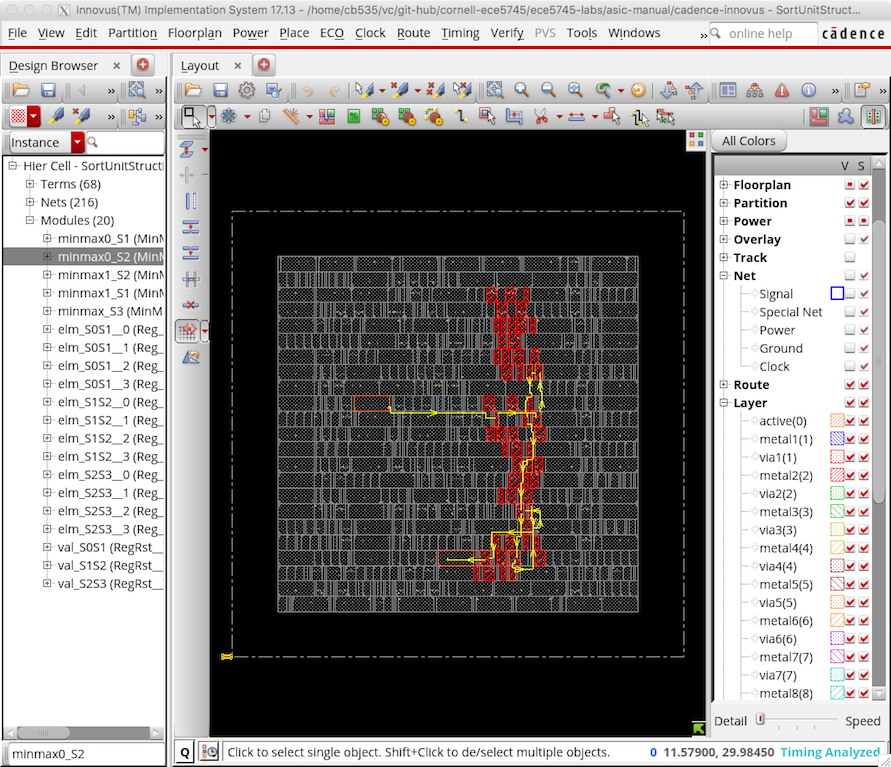
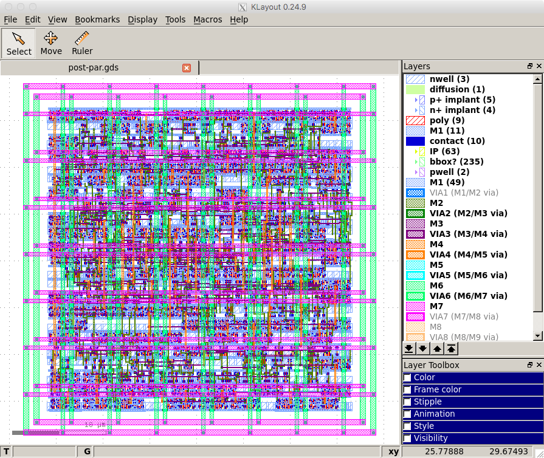

ECE 5745 Tutorial 4: Synopsys/Cadence ASIC Tools
==========================================================================

 - Author: Christopher Batten Jack Brzozowski
 - Date: January 29, 2023

**Table of Contents**

 - Introduction
 - Nangate 45nm Standard-Cell Library
 - PyMTL3-Based Testing, Simulation, Translation
 - Using Synopsys VCS for 4-State RTL Simulation
 - Using Synopsys Design Compiler for Synthesis
 - Using Synopsys VCS for Fast-Functional Gate-Level Simulation
 - Using Cadence Innovus for Place-and-Route
 - Using Synopsys PrimeTime for Power Analysis
 - Creating Your Own Mini-Flow for the GCD Unit

Introduction
--------------------------------------------------------------------------

This tutorial will discuss the various views that make-up a standard-cell
library and then illustrate how to use a set of Synopsys and Cadence ASIC
tools to map an RTL design down to these standard cells and ultimately
silicon. The tutorial will discuss the key tools used for synthesis,
place-and-route, simulation, and power analysis. This tutorial requires
entering commands manually for each of the tools to enable students to
gain a better understanding of the detailed steps involved in this
process. The next tutorial will illustrate how this process can be
automated to facilitate rapid design-space exploration. This tutorial
assumes you have already completed the tutorials on Linux, Git, and
Verilog.

The following diagram illustrates the five primary tools we will be using
in ECE 5745 along with a few smaller secondary tools. Notice that the
ASIC tools all require various views from the standard-cell library.



 1. We write our RTL models in Verilog, and we use the PyMTL framework to
    test, verify, and evaluate the execution time (in cycles) of our
    design. This part of the flow is very similar to the flow used in
    ECE 4750. Once we are sure our design is working correctly, we can
    then start to push the design through the flow.

 2. We use **Synopsys VCS** to compile and run both 4-state RTL and
    gate-level simulations. These simulations help us to build confidence
    in our design as we push our designs through different stages of the
    flow. From these simulations, we also generate waveforms in `.vcd`
    (Verilog Change Dump) format, and we use `vcd2saif` to convert these
    waveforms into per-net average activity factors stored in `.saif`
    format. These activity factors will be used for power analysis.
    Gate-level simulation is an valuable tool for ensuring the tools did
    not optimize something away which impacts the correctness of the
    design, and also provides an avenue for obtaining a more accurate
    power analysis than RTL simulation. While static timing analysis
    (STA) analyzes all paths, GL simulation can also serve as a backup to
    check for hold and setup time violations (chip designers must be
    paranoid!)

 3. We use **Synopsys Design Compiler (DC)** to synthesize our design,
    which means to transform the Verilog RTL model into a Verilog
    gate-level netlist where all of the gates are selected from the
    standard-cell library. We need to provide Synopsys DC with abstract
    logical and timing views of the standard-cell library in `.db`
    format. In addition to the Verilog gate-level netlist, Synopsys DC
    can also generate a `.ddc` file which contains information about the
    gate-level netlist and timing, and this `.ddc` file can be inspected
    using Synopsys Design Vision (DV).

 4. We use **Cadence Innovus** to place-and-route our design, which means
    to place all of the gates in the gate-level netlist into rows on the
    chip and then to generate the metal wires that connect all of the
    gates together. We need to provide Cadence Innovus with the same
    abstract logical and timing views used in Synopsys DC, but we also
    need to provide Cadence Innovus with technology information in
    `.lef`, and `.captable` format and abstract physical views of the
    standard-cell library also in `.lef` format. Cadence Innovus will
    generate an updated Verilog gate-level netlist, a `.spef` file which
    contains parasitic resistance/capacitance information about all nets
    in the design, and a `.gds` file which contains the final layout. The
    `.gds` file can be inspected using the open-source Klayout GDS
    viewer. Cadence Innovus also generates reports which can be used to
    accurately characterize area and timing.

 5. We use **Synopsys PrimeTime (PT)** to perform power analysis of our
    design. We need to provide Synopsys PT with the same abstract
    logical, timing, and power views used in Synopsys DC and Cadence
    Innovus, but in addition we need to provide switching activity
    information for every net in the design (which comes from the `.saif`
    file), and capacitance information for every net in the design (which
    comes from the `.spef` file). Synopsys PT puts the switching
    activity, capacitance, clock frequency, and voltage together to
    estimate the power consumption of every net and thus every module in
    the design, and these estimates are captured in various reports.

Extensive documentation is provided by Synopsys and Cadence for these
ASIC tools. We have organized this documentation and made it available to
you on the public course webpage:

 - <https://www.csl.cornell.edu/courses/ece5745/asicdocs>

The first step is to source the setup script, clone this repository from
GitHub, and define an environment variable to keep track of the top
directory for the project.

    % source setup-ece5745.sh
    % mkdir -p $HOME/ece5745
    % cd $HOME/ece5745
    % git clone git@github.com:cornell-ece5745/ece5745-tut4-asic-tools tut4
    % cd tut4
    % TOPDIR=$PWD

Nangate 45nm Standard-Cell Library
--------------------------------------------------------------------------

Before you can gain access to a standard-cell library, you need to gain
access to a "physical design kit" (PDK). A PDK includes all of the design
files required for full-custom circuit design for a specific technology.
So this will include a design-rule manual as well as SPICE circuit models
for transistors and other devices. Gaining access to a real PDK is
difficult. It requires negotiating with the foundry and signing multiple
non-disclosure agreements. So in this course we will be using the
FreePDK45 PDK:

 - <https://www.eda.ncsu.edu/wiki/FreePDK45>

This is an open PDK for a "fake" technology. It was created by
universities using publically available data on several different
commercial 45nm processes. This means you cannot actually tapeout a chip
using this PDK, but the technology is representative enough to provide
reasonable area, energy, and timing estimates for research and teaching
purposes. You can find the FreePDK45 PDK installed here:

    % cd $ADK_PKGS/freepdk-45nm/pkgs/FreePDK45-1.4

A standard-cell designer will use the PDK to implement the standard-cell
library. A standard-cell library is a collection of combinational and
sequential logic gates that adhere to a standardized set of logical,
electrical, and physical policies. For example, all standard cells are
usually the same height, include pins that align to a predetermined
vertical and horizontal grid, include power/ground rails and nwells in
predetermined locations, and support a predetermined number of drive
strengths. A standard-cell designer will usually create a high-level
behavioral specification (in Verilog), circuit schematics (in SPICE), and
the actual layout (in `.gds` format) for each logic gate. The Synopsys
and Cadence tools do not actually use these low-level implementations,
since they are actually _too_ detailed. Instead these tools use _abstract
views_ of the standard cells, which capture logical functionality,
timing, geometry, and power usage at a much higher level.

Just like with a PDK, gaining access to a real standard-cell library is
difficult. It requires gaining access to the PDK first, negotiating with
a company which makes standard cells, and usually signing more
non-disclosure agreements. In this course, we will be using the Nangate
45nm standard-cell library which is based on the open FreePDK45 PDK.

Nangate is a company which makes a tool to automatically generate
standard-cell libraries, so they have made this library publically
available a way to demonstrate their tool. Since it is an open library it
is a great resource for research and teaching. Even though the
standard-cell library is based on a "fake" 45nm PDK, the library provides
a very reasonable estimate of a real commercial standard library in a
real 45nm technology. In this section, we will take a look at both the
low-level implementations and high-level views of the Nangate
standard-cell library.

A standard-cell library distribution can contain gigabytes of data in
thousands of files. For example, here is the distribution for the Nangate
standard-cell library.

```
 % cd $ADK_PKGS/freepdk-45nm/pkgs/NangateOpenCellLibrary_PDKv1_3_v2010_12
```

To simplify using the Nangate standard-cell library in this course, we
have created a much smaller set of well-defined symlinks which point to
just the key files we want to use in this course. We call this collection
of symlinks an "ASIC design kit" (ADK). Here is the directory which
contains these symlinks.

```
 % cd $ECE5745_STDCELLS
 % ls
 pdk-models.sp          # spice models for transistors

 rtk-stream-out.map     # gds layer map
 rtk-tech.lef           # interconnect technology information
 rtk-tech.tf            # interconnect technology information
 rtk-typical.captable   # interconnect technology information

 stdcells.spi           # circuit schematics for each cell
 stdcells.gds           # layout for each cell
 stdcells.v             # behavioral specification for each cell

 stdcells-lpe.spi       # circuit schematics with parasitics for each cell
 stdcells.lib           # abstract logical, timing, power view for each cell (typical)
 stdcells-bc.lib        # best case .lib
 stdcells-wc.lib        # worst case .lib
 stdcells.lef           # abstract physical view for each cell

 stdcells.db            # binary compiled version of .lib file
 stdcells.mwlib         # Milkyway database built from .lef file

 stdcells-databook.pdf  # standard-cell library databook

 klayout.lyp            # layer settings for Klayout
```

Let's begin by looking at the schematic for a 3-input NAND cell
(NAND3_X1).

```
 % less -p NAND3_X1 $ECE5745_STDCELLS/stdcells.spi
 .SUBCKT NAND3_X1 A1 A2 A3 ZN VDD VSS
 *.PININFO A1:I A2:I A3:I ZN:O VDD:P VSS:G
 *.EQN ZN=!((A1 * A2) * A3)
 M_i_2 net_1 A3 VSS   VSS NMOS_VTL W=0.415000U L=0.050000U
 M_i_1 net_0 A2 net_1 VSS NMOS_VTL W=0.415000U L=0.050000U
 M_i_0 ZN    A1 net_0 VSS NMOS_VTL W=0.415000U L=0.050000U
 M_i_5 ZN    A3 VDD   VDD PMOS_VTL W=0.630000U L=0.050000U
 M_i_4 VDD   A2 ZN    VDD PMOS_VTL W=0.630000U L=0.050000U
 M_i_3 ZN    A1 VDD   VDD PMOS_VTL W=0.630000U L=0.050000U
 .ENDS
```

For students with a circuits background, there should be no surprises
here, and for those students with less circuits background we will cover
basic static CMOS gate design later in the course. Essentially, this
schematic includes three NMOS transistors arranged in series in the
pull-down network, and three PMOS transistors arranged in parallel in the
pull-up network. The PMOS transistors are larger than the NMOS
transistors (see `W=` parameter) because the mobility of holes is less
than the mobility of electrons.

Now let's look at the layout for the 3-input NAND cell using the
open-source Klayout GDS viewer.

```
 % klayout -l $ECE5745_STDCELLS/klayout.lyp $ECE5745_STDCELLS/stdcells.gds
```

Note that we are using the `.lyp` file which is a predefined layer color
scheme that makes it easier to view GDS files. To view the 3-input NAND
cell, find the NAND3_X1 cell in the left-hand cell list, and then choose
_Display > Show as New Top_ from the menu. Here is a picture of the
layout for this cell.



Diffusion is green, polysilicon is red, contacts are solid dark blue,
metal 1 (M1) is blue, and the nwell is the large gray rectangle over the
top half of the cell. All standard cells will be the same height and have
the nwell in the same place. Notice the three NMOS transistors arranged
in series in the pull-down network, and three PMOS transistors arranged
in parallel in the pull-up network. The power rail is the horizontal
strip of M1 at the top, and the ground rail is the horizontal strip of M1
at the bottom. All standard cells will have the power and ground rails in
the same place so they will connect via abutment if these cells are
arranged in a row. Although it is difficult to see, the three input pins
and one output pin are labeled squares of M1, and these pins are arranged
to be on a predetermined grid.

Now let's look at the Verilog behavioral specification for the 3-input
NAND cell.

```
 % less -p NAND3_X1 $ECE5745_STDCELLS/stdcells.v
 module NAND3_X1 (A1, A2, A3, ZN);
   input A1;
   input A2;
   input A3;
   output ZN;

   not(ZN, i_8);
   and(i_8, i_9, A3);
   and(i_9, A1, A2);

   specify
     (A1 => ZN) = (0.1, 0.1);
     (A2 => ZN) = (0.1, 0.1);
     (A3 => ZN) = (0.1, 0.1);
   endspecify

 endmodule
```

Note that the Verilog implementation of the 3-input NAND cell looks
nothing like the Verilog we used in ECE 4750. This cell is implemented
using Verilog primitive gates (e.g., `not`, `and`) and it includes a
`specify` block which is used for advanced gate-level simulation with
back-annotated delays.

We can use sophisticated tools to extract detailed parasitic resistance
and capacitance values from the layout, and then we can add these
parasitics to the circuit schematic to create a much more accurate model
for experimenting with the circuit timing and power. Let's look at a
snippet of the extracted circuit for the 3-input NAND cell:

```
 % less -p NAND3_X1 $ECE5745_STDCELLS/stdcells-lpe.spi
 .SUBCKT NAND3_X1 VDD VSS A3 ZN A2 A1
 *.PININFO VDD:P VSS:G A3:I ZN:O A2:I A1:I
 *.EQN ZN=!((A1 * A2) * A3)
 M_M3 N_ZN_M0_d  N_A3_M0_g N_VDD_M0_s VDD PMOS_VTL W=0.630000U L=0.050000U
 M_M4 N_VDD_M1_d N_A2_M1_g N_ZN_M0_d  VDD PMOS_VTL W=0.630000U L=0.050000U
 M_M5 N_ZN_M2_d  N_A1_M2_g N_VDD_M1_d VDD PMOS_VTL W=0.630000U L=0.050000U
 M_M0 net_1      N_A3_M3_g N_VSS_M3_s VSS NMOS_VTL W=0.415000U L=0.050000U
 M_M1 net_0      N_A2_M4_g net_1      VSS NMOS_VTL W=0.415000U L=0.050000U
 M_M2 N_ZN_M5_d  N_A1_M5_g net_0      VSS NMOS_VTL W=0.415000U L=0.050000U
 C_x_PM_NAND3_X1%VDD_c0 x_PM_NAND3_X1%VDD_39 VSS 3.704e-17
 C_x_PM_NAND3_X1%VDD_c1 x_PM_NAND3_X1%VDD_36 VSS 2.74884e-18
 C_x_PM_NAND3_X1%VDD_c2 x_PM_NAND3_X1%VDD_26 VSS 2.61603e-16
 C_x_PM_NAND3_X1%VDD_c3 N_VDD_M1_d           VSS 6.57971e-17
 C_x_PM_NAND3_X1%VDD_c4 x_PM_NAND3_X1%VDD_19 VSS 1.89932e-17
 C_x_PM_NAND3_X1%VDD_c5 x_PM_NAND3_X1%VDD_18 VSS 3.74888e-17
 C_x_PM_NAND3_X1%VDD_c6 N_VDD_M0_s           VSS 3.64134e-17
 ...
 .ENDS
```

The full model is a couple of hundred lines long, so you can see how
detailed this model is! The ASIC tools do not really need this much
detail. We can use a special set of tools to create a much higher level
abstract view of the timing and power of this circuit suitable for use by
the ASIC tools. Essentially, these tools run many, many circuit-level
simulations to create characterization data stored in a `.lib` (Liberty)
file. Let's look at snippet of the `.lib` file for the 3-input NAND cell.

```
 % less -p NAND3_X1 $ECE5745_STDCELLS/stdcells.lib
 cell (NAND3_X1) {
  drive_strength          : 1;
  area                    : 1.064000;
  cell_leakage_power      : 18.104768;
  leakage_power () {
    when                  : "!A1 & !A2 & !A3";
    value                 : 3.318854;
  }
  ...
  pin (A1) {
    direction             : input;
    related_power_pin     : "VDD";
    related_ground_pin    : "VSS";
    capacitance           : 1.590286;
    fall_capacitance      : 1.562033;
    rise_capacitance      : 1.590286;
  }
  ...
  pin (ZN) {
    direction             : output;
    related_power_pin     : "VDD";
    related_ground_pin    : "VSS";
    max_capacitance       : 58.364900;
    function              : "!((A1 & A2) & A3)";

    timing () {

      related_pin         : "A1";
      timing_sense        : negative_unate;

      cell_fall(Timing_7_7) {
        index_1 ("0.00117378,0.00472397,0.0171859,0.0409838,0.0780596,0.130081,0.198535");
        index_2 ("0.365616,1.823900,3.647810,7.295610,14.591200,29.182500,58.364900");
        values ("0.0106270,0.0150189,0.0204521,0.0312612,0.0528211,0.0959019,0.182032", \
                "0.0116171,0.0160692,0.0215549,0.0324213,0.0540285,0.0971429,0.183289", \
                "0.0157475,0.0207077,0.0261030,0.0369216,0.0585239,0.101654,0.187820", \
                "0.0193780,0.0263217,0.0337702,0.0462819,0.0677259,0.110616,0.196655", \
                "0.0218025,0.0305247,0.0399593,0.0560603,0.0822203,0.125293,0.210827", \
                "0.0229784,0.0334449,0.0447189,0.0640615,0.0959700,0.146382,0.231434", \
                "0.0227986,0.0349768,0.0480836,0.0705081,0.107693,0.167283,0.259623");
      }
      ...

      internal_power () {
        related_pin       : "A1";
        fall_power(Power_7_7) {
          index_1 ("0.00117378,0.00472397,0.0171859,0.0409838,0.0780596,0.130081,0.198535");
          index_2 ("0.365616,1.823900,3.647810,7.295610,14.591200,29.182500,58.364900");
          values ("0.523620,0.538965,0.551079,0.556548,0.561151,0.564018,0.564418", \
                  "0.459570,0.484698,0.509668,0.529672,0.543887,0.554682,0.559331", \
                  "0.434385,0.457202,0.470452,0.498312,0.517651,0.538469,0.550091", \
                  "0.728991,0.630651,0.581024,0.559124,0.551408,0.553714,0.557387", \
                  "1.306597,1.153240,1.010684,0.831268,0.727155,0.657699,0.616287", \
                  "2.170611,1.965158,1.760932,1.459438,1.140559,0.930355,0.781393", \
                  "3.276307,3.084566,2.831754,2.426623,1.913607,1.439055,1.113950");
        }
        ...
      }
  ...
 }
```

This is just a small subset of the information included in the `.lib`
file for this cell. We will talk more about the details of such `.lib`
files later in the course, but you can see that the `.lib` file contains
information about area, leakage power, capacitance of each input pin,
logical functionality, and timing. Units for all data is provided at the
top of the `.lib` file. In this snippet you can see that the area of the
cell is 1.064 square micron and the leakage power is 18.1nW. The
capacitance for the input pin `A1` is 1.59fF, although there is
additional data that captures how the capacitance changes depending on
whether the input is rising or falling. The output pin `ZN` implements
the logic equation `!((A1 & A2) & A3)` (i.e., a three-input NAND gate).
Data within the `.lib` file is often represented using one- or
two-dimensional lookup tables (i.e., a `values` table). You can see two
such tables in the above snippet.

Let's start by focusing on the first table. This table captures the delay
from input pin `A1` to output pin `ZN` as a function of two parameters:
the input transition time (horizontal direction in lookup table) and the
load capacitance (vertical direction in lookup table). Note that this
delay is when `ZN` is "falling" (i.e., when it is transitioning from high
to low). There is another table for the delay when `ZN` is rising, and
there are additional tables for every input. Gates are slower when the
inputs take longer to transition and/or when they are driving large
output loads. Each entry in the lookup table reflects characterization of
one or more detailed circuit-level simulations. So in this example the
delay from input pin `A1` to output pin `ZN` is 16ps when the input
transition rate is 4.7ps and the output load is 1.82fF. This level of
detail can enable very accurate static timing analysis of our designs.

Let's now focus on the second table. This table captures the internal
power, which is the power consumed within the gate itself, again as a
function of two paramers: the input transition time (horizontal direction
in lookup table) and the load capacitance (vertical direction in lookup
table). Each entry in the lookup table is calculated by measuring the
current drawn from the power supply during a detailed SPICE simulation
and _subtracting_ any current used to charge the output load. In other
words all of the energy that is _not_ consumed charging up the output
load is considered internal energy. Note that sometimes the internal
power is negative. This is simply due to how we account for energy. We
can either assume all energy is consumed only when the output node is
charged and no energy is consumed when the output node is discharged,
_or_ we can assume half the energy is consumed when the output is node is
charged and half the energy is consumed when the output node is
discharged in which case you will sometimes see negative internal power.

Note that some of the ASIC tools actually do not use the `.lib` file
directly, but instead use a pre-compiled binary version of the `.lib`
file stored in `.db` format. The binary `.db` file is usually much more
compact that the text `.lib` file. The `.lib` file captures the abstract
logical, timing, and power aspects of the standard-cell library, but it
does not capture the physical aspects of the standard-cell library. While
the ASIC tools could potentially use the `.gds` file directly, the ASIC
tools do not really need this much detail. We can use a special set of
tools to create a much higher level abstract view of the physical aspects
of the cell suitable for use by the ASIC tools. These tools create `.lef`
files. Let's look at snippet of the the `.lef` file for the 3-input NAND
cell.

```
 % less -p NAND3_X1 $ECE5745_STDCELLS/stdcells.lef
MACRO NAND3_X1
  CLASS core ;
  FOREIGN NAND3_X1 0.0 0.0 ;
  ORIGIN 0 0 ;
  SYMMETRY X Y ;
  SITE FreePDK45_38x28_10R_NP_162NW_34O ;
  SIZE 0.76 BY 1.4 ;

  PIN A1
    DIRECTION INPUT ;
    ANTENNAPARTIALMETALAREA 0.0175 LAYER metal1 ;
    ANTENNAPARTIALMETALSIDEAREA 0.0715 LAYER metal1 ;
    ANTENNAGATEAREA 0.05225 ;
    PORT
      LAYER metal1 ;
        POLYGON 0.44 0.525 0.54 0.525 0.54 0.7 0.44 0.7  ;
    END
  END A1

  PIN ZN
    DIRECTION OUTPUT ;
    ANTENNAPARTIALMETALAREA 0.1352 LAYER metal1 ;
    ANTENNAPARTIALMETALSIDEAREA 0.4992 LAYER metal1 ;
    ANTENNADIFFAREA 0.197925 ;
    PORT
      LAYER metal1 ;
        POLYGON 0.235 0.8 0.605 0.8 0.605 0.15 0.675 0.15
         0.675 1.25 0.605 1.25 0.605 0.87 0.32 0.87 0.32 1.25 0.235 1.25  ;
    END
  END ZN

  PIN VDD
    DIRECTION INOUT ;
    USE power ;
    SHAPE ABUTMENT ;
    PORT
      LAYER metal1 ;
        POLYGON 0 1.315 0.04 1.315 0.04 0.975 0.11 0.975 0.11 1.315
         0.415 1.315 0.415 0.975 0.485 0.975 0.485 1.315 0.76 1.315 0.76 1.485 0 1.485  ;
    END
  END VDD

  ...
END NAND3_X1
```

This is just a small subset of the information included in the `.lef`
file for this cell. You can see the `.lef` file includes information on
the dimensions of the cell and the location and dimensions of both
power/ground and signal pins. The file also includes information on
"obstructions" (or blockages) indicated with a `OBS` entry. Take a look
at the NAND4_X4 gate to see an obstruction. These are regions of the cell
which should not be used by the ASIC tools. For example, if a cell needs
to use metal 2 (M2), it would create a blockage on M2 so that the ASIC
tools know not to route any M2 wires in that area. You can use Klayout to
view `.lef` files as well.

```
 % klayout
```

Choose _File > Import > LEF_ from the menu. Navigate to the
`stdcells.lef` file. Here is a picture of the `.lef` for this cell.



If you compare the `.lef` to the `.gds` you can see that the `.lef` is a
much simpler representation that only captures the boundary, pins, and
obstructions.

The standard-cell library also includes several files (e.g.,
`rtk-tech.tf`, `rtk-tech.lef`, `rtk-typical.captable`) that capture
information about the metal interconnect including the wire width, pitch,
and parasitics. For example, let's take a look at the `.captable` file:

```
 % less -p M1 $ECE5745_STDCELLS/rtk-typical.captable
 LAYER M1
   MinWidth              0.07000
   MinSpace              0.06500
#  Height                0.37000
   Thickness             0.13000
   TopWidth              0.07000
   BottomWidth           0.07000
   WidthDev              0.00000
   Resistance            0.38000
 END
 ...
 M1
 width(um)  space(um) Ctot(Ff/um)  Cc(Ff/um)    Carea(Ff/um) Cfrg(Ff/um)
 0.070       0.052       0.1986       0.0723       0.0311       0.0115
 0.070       0.065       0.1705       0.0509       0.0311       0.0143
 0.070       0.200       0.1179       0.0115       0.0311       0.0319
 0.070       0.335       0.1150       0.0030       0.0311       0.0388
 0.070       0.470       0.1148       0.0009       0.0311       0.0409
 0.070       0.605       0.1147       0.0002       0.0311       0.0416
 0.070       0.740       0.1147       0.0001       0.0311       0.0417
```

This file contains information about the minimum dimenisions of wires on
M1 and the resistance of these wires. It also contains a table of wire
capacitances with different rows for different wire widths and spacings.
The ASIC tools can use this kind of technology information to optimize
and analyze the design.

Finally, a standard-cell library will always include a databook, which is
a document that describes the details of every cell in the library. Take
a few minutes to browse through the Nangate standard-cell library
databook located on the class Canvas page here:

 - <https://www.csl.cornell.edu/courses/ece5745/resources/nangate-freepdk45nm-stdcell-databook.pdf>

PyMTL3-Based Testing, Simulation, Translation
--------------------------------------------------------------------------

Our goal in this tutorial is to generate layout for the sort unit from
the Verilog tutorial using the ASIC tools. As a reminder, the sort unit
takes as input four integers and a valid bit and outputs those same four
integers in increasing order with the valid bit. The sort unit is
implemented using a three-stage pipelined, bitonic sorting network and
the datapath is shown below.


Let's start by running the tests for the sort unit and note that the
tests for the `SortUnitStruct` will fail.

```bash
 % mkdir -p $TOPDIR/sim/build
 % cd $TOPDIR/sim/build
 % pytest ../tut3_verilog/sort
```

You can just copy over your implementation of the `MinMaxUnit` from when
you completed the Verilog tutorial. If you have not completed the Verilog
tutorial then you might want to go back and do that now. Basically the
`MinMaxUnit` should look like this:

```python
module tut3_verilog_sort_MinMaxUnit
#(
  parameter p_nbits = 1
)(
  input  logic [p_nbits-1:0] in0,
  input  logic [p_nbits-1:0] in1,
  output logic [p_nbits-1:0] out_min,
  output logic [p_nbits-1:0] out_max
);

  always_comb begin

    // Find min/max

    if ( in0 >= in1 ) begin
      out_max = in0;
      out_min = in1;
    end
    else if ( in0 < in1 ) begin
      out_max = in1;
      out_min = in0;
    end

    // Handle case where there is an X in the input

    else begin
      out_min = 'x;
      out_max = 'x;
    end

  end

endmodule
```

Once you have your design working rerun the tests with the
`--test-verilog` and `--dump-vtb` commadn line options.

```
 % pytest ../tut3_verilog/sort --test-verilog --dump-vtb
```

The `--test-verilog` and `--dump-vtb` command line options tells the
PyMTL3 framework to dump a Verilog testbench. While PyMTL3 enables
combining Python testbenches with Verilator Verilog simulation, we need
to translate our testbenches to Verilog so that we can use Synopsys VCS
to do 4-state and gate-level simulation. Let's look at a testbench cases
file generated from using the `--dump-vtb` flag.

```
 % cd $TOPDIR/sim/build
 % cat SortUnitStruct__p_nbits_8_test_basic_tb.v.cases

  `T('h00,'h00,'h00,'h00,'h0,'h00,'h00,'h00,'h00,'h0);
  `T('h04,'h02,'h03,'h01,'h1,'h00,'h00,'h00,'h00,'h0);
  `T('h00,'h00,'h00,'h00,'h0,'h00,'h00,'h00,'h00,'h0);
  `T('h00,'h00,'h00,'h00,'h0,'h00,'h00,'h00,'h00,'h0);
  `T('h00,'h00,'h00,'h00,'h0,'h01,'h02,'h03,'h04,'h1);
  `T('h00,'h00,'h00,'h00,'h0,'h00,'h00,'h00,'h00,'h0);
  `T('h00,'h00,'h00,'h00,'h0,'h00,'h00,'h00,'h00,'h0);
  `T('h00,'h00,'h00,'h00,'h0,'h00,'h00,'h00,'h00,'h0);
  `T('h00,'h00,'h00,'h00,'h0,'h00,'h00,'h00,'h00,'h0);
```

This file is generated by logging the inputs and outputs of the Verilator
RTL simulation each cycle. It will be passed into a Verilog testbench
runner that will use these values to set the inputs each cycle and to
verify the outputs each cycle. So note that when we utilize these
testbenches later on, we are running a simulation that is simply
confirming that we acheive the same behavior as the Verilator RTL
simulation we ran using PyMTL3, and it is not actually using any
assertions you wrote in your Python tests for your design. Therefore, it
is important that your RTL simulations pass using PyMTL3 and Verilator
before you move on to other simulations. Also take a look at the
testbench itself to get a sense for how it works. It essentially
instantiates your top module as 'DUT', sets the inputs, and performs a
check every cycle on the outputs.

```
 % less SortUnitStruct__p_nbits_8_test_basic_tb.v
```

After running the tests we use the sort unit simulator to do the final
evaluation.

```bash
 % cd $TOPDIR/sim/build
 % ../tut3_verilog/sort/sort-sim --impl rtl-struct --stats --translate --dump-vtb
 num_cycles          = 106
 num_cycles_per_sort = 1.06
```

Take a moment to open up the translated Verilog which should be in a file
named `SortUnitStruct__p_nbits_8__pickled.v`. The Verilog module name
includes a suffix to make it unique for a specific set of parameters.

Using Synopsys VCS for 4-state RTL simulation
-------------------------------------------------------------------------

Using the PyMTL simulation framework can give us a good foundation in
verifying a design. However, the Verilator RTL simulator is only a
2-state simulation, meaning a signal can only be `0` or `1`. An
alternative form of RTL simulation is a 4-state simulation, in which
signals can be `0`, `1`, `x`, or `z`.

It is important to note a key difference between 2-state and 4-state
simulation. In 2-state simulation, each variable is initialized to a
predetermined value. This initial condition assumption may or may not be
what happens in actual silicon! As a result, a different initial
condition could introduce a bug that was not caught by our 2-state
Verilator RTL simulation. In 4-state simulations no such assumptions are
made. Instead, every signal begins as `x`, and only resolves to a `0` or
`1` after it is driven or resolved using x-propagation. Consider the
following pseudocode:

```Verilog
 always @(*)
 begin
   if ( control_signal )
     // set signal "signal_a", but bug causes chip to fail
   else
     // set signal "signal_a" such that everything works fine
 end
```

If control_signal is not reset, then in 2-state simulation if you
initialize all state to zero it will look like the chip works fine, but
this is not a safe assumption! The real chip does not guarantee that all
state is initialized to zero, so we can model that in four state
simulation as an `x`. Since the control signal could initialize to 1,
this could non-deterministically cause the chip to fail! What you would
see in simulation is that signal_a would become an `x`, because we do not
know the value of control_signal on reset. This `x` is propagated through
the design, and some simulators are more optimistic/pessimistic about x's
than others. For example, a pessimistic simulator may just assume that
any piece of logic that has an x on the input, outputs an x. This is
pessimistic because it is *possible* that you can still resolve the
output (imagine a mux where two inputs are the same but the select bit is
an `x`). Optimism is the opposite, resolving signals to `0` or `1` that
should remain an `x`.

If your design is passing every 2-state simulation, but failing every
4-state simulation, it may be because invalid vields are being set to
`x`'s. Our test harnesses require all outputs to always be `0` or `1`
even if a field is invalid. So you may need to force invalid fields to
zero and ensure that during a correct execution the outputs of your
module are never `x`'s. You can see this in the implementation of
`SortUnitStruct`:

```Verilog
  assign out_val = val_S3;
  assign out0    = elm0_S3         & {p_nbits{val_S3}};
  assign out1    = mmuA_out_min_S3 & {p_nbits{val_S3}};
  assign out2    = mmuA_out_max_S3 & {p_nbits{val_S3}};
  assign out3    = elm3_S3         & {p_nbits{val_S3}};
```

To create a 4-state simulation, let's start by creating another build
directory for our Synopsys VCS work.

```bash
 % mkdir -p $TOPDIR/asic/build-sort/vcs-rtl-build
 % cd $TOPDIR/asic/build-sort/vcs-rtl-build
```

We run Synopsys VCS to compile a simulation, and ./simv to run the simulation.
Let's run a 4-state simulation for `test_basic` using the design
`SortUnitStruct__p_nbits_8__pickled.v`.

```bash
 % cd $TOPDIR/asic/build-sort/vcs-rtl-build
 % vcs -full64 -sverilog +lint=all -xprop=tmerge -override_timescale=1ns/1ps \
    +incdir+../../../sim/build \
    +vcs+dumpvars+SortUnitStruct__p_nbits_8_test_basic_vcs.vcd \
    -top SortUnitStruct__p_nbits_8_tb \
    ../../../sim/build/SortUnitStruct__p_nbits_8_test_basic_tb.v \
    ../../../sim/build/SortUnitStruct__p_nbits_8__pickled.v
 % ./simv
```

Here some of the key command line options for Synopsys VCS:

```
 -sverilog                           indicates we are using SystemVerilog
 -xprop=tmerge                       use more advanced X propoagation
 -override_timescale=1ns/1ps         changes the timescale. Units/precision
 +incdir+../../../sim/build          specifies directories to search for `include
 +vcs+dumpvars+filename.vcd          dump VCD in current dir with the name filename.vcd
 -top SortUnitStruct__p_nbits_8_tb   name of the top module (located within the VTB)
```

Synopsys VCS is a sophisticated tool with many command line options. If
you want to learn more on your own about other options that are available
to you with Synopsys VCS, you can look at the user guides on the course
webpage:

 - <https://www.csl.cornell.edu/courses/ece5745/asicdocs>

Let's run another 4-state simulation, this time using the testbench from
the sort-rtl simulator run that we ran earlier. Note that while we can
use this VCD for power analysis, for the purposes of this tutorial we
will only be doing power analysis using the gate-level netlist.

```bash
 % cd $TOPDIR/asic/build-sort/vcs-rtl-build
 % vcs -full64 -sverilog +lint=all -xprop=tmerge -override_timescale=1ns/1ps \
    +incdir+../../../sim/build \
    +vcs+dumpvars+SortUnitStruct__p_nbits_8_sort-rtl-struct-random_vcs.vcd \
    -top SortUnitStruct__p_nbits_8_tb \
    ../../../sim/build/SortUnitStruct__p_nbits_8_sort-rtl-struct-random_tb.v \
    ../../../sim/build/SortUnitStruct__p_nbits_8__pickled.v
 % ./simv
```

To simplify rerunning a simulation, considering putting the above command
line in a shell script so you can run it as follows:

```
 % cd $TOPDIR/asic/build-sort/vcs-rtl-build
 % source ./run.sh
```

Using Synopsys Design Compiler for Synthesis
--------------------------------------------------------------------------

We use Synopsys Design Compiler (DC) to synthesize Verilog RTL models
into a gate-level netlist where all of the gates are from the standard
cell library. So Synopsys DC will synthesize the Verilog `+` operator
into a specific arithmetic block at the gate-level. Based on various
constraints it may synthesize a ripple-carry adder, a carry-look-ahead
adder, or even more advanced parallel-prefix adders.

We start by creating a subdirectory for our work, and then launching
Synopsys DC.

```bash
 % mkdir -p $TOPDIR/asic/build-sort/synopsys-dc
 % cd $TOPDIR/asic/build-sort/synopsys-dc
 % dc_shell-xg-t
```

To make it easier to copy-and-paste commands from this document, we tell
Synopsys DC to ignore the prefix `dc_shell>` using the following:

```
 dc_shell> alias "dc_shell>" ""
```

There are two important variables we need to set before starting to work
in Synopsys DC. The `target_library` variable specifies the standard
cells that Synopsys DC should use when synthesizing the RTL. The
`link_library` variable should search the standard cells, but can also
search other cells (e.g., SRAMs) when trying to resolve references in our
design. These other cells are not meant to be available for Synopsys DC
to use during synthesis, but should be used when resolving references.
Including `*` in the `link_library` variable indicates that Synopsys DC
should also search all cells inside the design itself when resolving
references.

```
 dc_shell> set_app_var target_library "$env(ECE5745_STDCELLS)/stdcells.db"
 dc_shell> set_app_var link_library   "* $env(ECE5745_STDCELLS)/stdcells.db"
```

Note that we can use `$env(ECE5745_STDCELLS)` to get access to the
`$ECE5745_STDCELLS` environment variable which specifies the directory
containing the standard cells, and that we are referencing the abstract
logical and timing views in the `.db` format.

As an aside, if you want to learn more about any command in any Synopsys
tool, you can simply type `man toolname` at the shell prompt. We are now
ready to read in the Verilog file which contains the top-level design and
all referenced modules. We do this with two commands. The `analyze`
command reads the Verilog RTL into an intermediate internal
representation. The `elaborate` command recursively resolves all of the
module references starting from the top-level module, and also infers
various registers and/or advanced data-path components.

```
 dc_shell> analyze -format sverilog ../../../sim/build/SortUnitStruct__p_nbits_8__pickled.v
 dc_shell> elaborate SortUnitStruct__p_nbits_8
```

We need to create a clock constraint to tell Synopsys DC what our target
cycle time is. Synopsys DC will not synthesize a design to run "as fast
as possible". Instead, the designer gives Synopsys DC a target cycle time
and the tool will try to meet this constraint while minimizing area and
power. The `create_clock` command takes the name of the clock signal in
the Verilog (which in this course will always be `clk`), the label to
give this clock (i.e., `ideal_clock1`), and the target clock period in
nanoseconds. So in this example, we are asking Synopsys DC to see if it
can synthesize the design to run at 3.33GHz (i.e., a cycle time of
300ps).

```
 dc_shell> create_clock clk -name ideal_clock1 -period 0.3
```

In an ideal world, all inputs and outputs would change immediately with
the clock edge. In reality, this is not the case. We need to include
reasonable delays for inputs and outputs, so Synopsys DC can factor this
into its timing analysis so we would still meet timing if we were to tape
our design out in real silicon. Here, we choose 5% of the clock period
for our input and output delays.

```
 dc_shell> set_input_delay  -clock ideal_clock1 [expr 0.3*0.05] [all_inputs]
 dc_shell> set_output_delay -clock ideal_clock1 [expr 0.3*0.05] [all_outputs]
```

Next, we give Synopsys DC some constraints about fanout and transition
slew. Fanout roughly describes the number of inputs driven by a
particular output, and the higher the fanout, the higher the drive
strength required. Slew rate is how quickly a signal can make a full
transition. We want all of our signals to meet a good slew, meaning that
they can transition quickly, so we set maximum slew to one quarter of the
clock period.

```
 dc_shell> set_max_fanout 20 SortUnitStruct__p_nbits_8
 dc_shell> set_max_transition [expr 0.25*0.3] SortUnitStruct__p_nbits_8
```

We can use the `check_design` command to make sure there are no obvious
errors in our Verilog RTL.

```
 dc_shell> check_design
```

It is _critical_ that you carefully review all warnings and errors when
you analyze and elaborate a design with Synopsys DC. There may be many
warnings, but you should still skim through them. Often times there will
be something very wrong in your Verilog RTL which means any results from
using the ASIC tools is completely bogus. Synopsys DC will output a
warning, but Synopsys DC will usually just keep going, potentially
producing a completely incorrect gate-level model!

Finally, the `compile` command will do the synthesis.

```
 dc_shell> compile
```

During synthesis, Synopsys DC will display information about its
optimization process. It will report on its attempts to map the RTL into
standard-cells, optimize the resulting gate-level netlist to improve the
delay, and then optimize the final design to save area.

The `compile` command does not _flatten_ your design. Flatten means to
remove module hierarchy boundaries; so instead of having module A and
module B within module C, Synopsys DC will take all of the logic in
module A and module B and put it directly in module C. You can enable
flattening with the `-ungroup_all` option. Without extra hierarchy
boundaries, Synopsys DC is able to perform more optimizations and
potentially achieve better area, energy, and timing. However, an
unflattened design is much easier to analyze, since if there is a module
A in your RTL design that same module will always be in the synthesized
gate-level netlist.

The `compile` command does not perform many optimizations. Synopsys DC
also includes `compile_ultra` which does many more optimizations and will
likely produce higher quality of results. Keep in mind that the `compile`
command _will not_ flatten your design by default, while the
`compile_ultra` command _will_ flattened your design by default. You can
turn off flattening by using the `-no_autoungroup` option with the
`compile_ultra` command. `compile_ultra` also has the option
`-gate_clock` which automatically performs clock gating on your design,
which can save quite a bit of power. Once you finish this tutorial, feel
free to go back and experiment with the `compile_ultra` command.

Now that we have synthesized the design, we output the resulting
gate-level netlist in two different file formats: Verilog and `.ddc`
(which we will use with Synopsys DesignVision). We also output an `.sdc`
file which contains the constraint information we gave Synopsys DC. We
will pass this same constraint information to Cadence Innovus during the
place and route portion of the flow.

```
 dc_shell> write -format verilog -hierarchy -output post-synth.v
 dc_shell> write -format ddc     -hierarchy -output post-synth.ddc
 dc_shell> write_sdc -nosplit post-synth.sdc
```

We can use various commands to generate reports about area, energy, and
timing. The `report_timing` command will show the critical path through
the design. Part of the report is displayed below. Note that this report
was generated using a clock constraint of 300ps.

```
 dc_shell> report_timing -nosplit -transition_time -nets -attributes
  ...
  Point                                       Fanout Trans Incr  Path
  --------------------------------------------------------------------------
  clock ideal_clock1 (rise edge)                           0.00  0.00
  clock network delay (ideal)                              0.00  0.00
  v/elm2_S2S3/q_reg[2]/CK (DFF_X1)                   0.00  0.00  0.00 r
  v/elm2_S2S3/q_reg[2]/Q (DFF_X1)                    0.01  0.09  0.09 r
  v/elm2_S2S3/q[2] (net)                      3            0.00  0.09 r
  v/elm2_S2S3/q[2] (vc_Reg_p_nbits8_2)                     0.00  0.09 r
  v/elm2_S3[2] (net)                                       0.00  0.09 r
  v/mmuA_S3/in1[2] (MinMaxUnit_p_nbits8_1)           0.00        0.09 r
  v/mmuA_S3/in1[2] (net)                                   0.00  0.09 r
  v/mmuA_S3/U25/ZN (INV_X1)                          0.01  0.02  0.12 f
  v/mmuA_S3/n11 (net)                         1            0.00  0.12 f
  v/mmuA_S3/U3/ZN (NAND2_X1)                         0.01  0.02  0.14 r
  v/mmuA_S3/n8 (net)                          1            0.00  0.14 r
  v/mmuA_S3/U20/ZN (NAND4_X1)                        0.02  0.04  0.18 f
  v/mmuA_S3/net7323 (net)                     1            0.00  0.18 f
  v/mmuA_S3/U11/ZN (OAI221_X1)                       0.05  0.06  0.24 r
  v/mmuA_S3/net7315 (net)                     2            0.00  0.24 r
  v/mmuA_S3/U13/ZN (AND2_X2)                         0.03  0.07  0.31 r
  v/mmuA_S3/net7572 (net)                     8            0.00  0.31 r
  v/mmuA_S3/U53/Z (MUX2_X1)                          0.01  0.08  0.40 f
  v/mmuA_S3/out_min[0] (net)                  1            0.00  0.40 f
  v/mmuA_S3/out_min[0] (MinMaxUnit_p_nbits8_1)       0.00        0.40 f
  v/mmuA_out_min_S3[0] (net)                               0.00  0.40 f
  v/U30/ZN (AND2_X1)                                 0.01  0.03  0.43 f
  v/out1[0] (net)                             1            0.00  0.43 f
  v/out1[0] (SortUnitStruct_p_nbits8)                0.00        0.43 f
  out1[0] (net)                                            0.00  0.43 f
  out1[0] (out)                                      0.01  0.00  0.43 f
  data arrival time                                              0.43

  clock ideal_clock1 (rise edge)                           0.30  0.30
  clock network delay (ideal)                              0.00  0.30
  output external delay                                   -0.01  0.29
  data required time                                             0.29
  ---------------------------------------------------------------------------------------------------------
  data required time                                             0.29
  data arrival time                                             -0.43
  ---------------------------------------------------------------------------------------------------------
  slack (VIOLATED)                                              -0.15
```

This timing report uses _static timing analysis_ to find the critical
path. Static timing analysis checks the timing across all paths in the
design (regardless of whether these paths can actually be used in
practice) and finds the longest path. For more information about static
timing analysis, consult Chapter 1 of the [Synopsys Timing Constraints
and Optimization User
Guide](http://www.csl.cornell.edu/courses/ece5745/asicdocs/tcoug.pdf).
The report clearly shows that the critical path starts at bit 2 of a
pipeline register in between the S2 and S3 stages (`elm2_S2S3`), goes
into an input of a `MinMaxUnit`, comes out the `out_min` port of the
`MinMaxUnit`, and ends at a top-level output port (`out1`). The report
shows the delay through each logic gate (e.g., the clk-to-q delay of the
initial DFF is 90ps, the propagation delay of a NAND2_X1 gate is 20ps)
and the total delay for the critical path which in this case is 0.43ns.
We set the clock constraint to be 300ps, but also notice that the report
factors in the output delay we set with the `set_output_delay` command.

The difference between the required arrival time and the actual arrival
time is called the _slack_. Positive slack means the path arrived before
it needed to while negative slack means the path arrived after it needed
to. If you end up with negative slack, then you need to rerun the tools
with a longer target clock period until you can meet timing with no
negative slack. The process of tuning a design to ensure it meets timing
is called "timing closure". In this course, we are primarily interested
in design-space exploration as opposed to meeting some externally defined
target timing specification. So you will need to sweep a range of target
clock periods. **Your goal is to choose the shortest possible clock
period which still meets timing without any negative slack!** This will
result in a well-optimized design and help identify the "fundamental"
performance of the design. Alternatively, if you are comparing multiple
designs, sometimes the best situation is to tune the baseline so it meets
timing and then ensure the alternative designs have similar cycle times.
This will enable a fair comparison since all designs will be running at
the same cycle time.

The `report_area` command can show how much area each module uses and can
enable detailed area breakdown analysis.

```
 dc_shell> report_area -nosplit -hierarchy
 ...
 Combinational area:         388.626001
 Buf/Inv area:                88.843999
 Noncombinational area:      449.273984
 Macro/Black Box area:         0.000000
 Net Interconnect area:       undefined  (Wire load has zero net area)

 Total cell area:            837.899985
 Total area:                  undefined

 Hierarchical area distribution
 ------------------------------

                 Global      Local
                 Cell Area   Cell Area
                 ----------  ----------------
 Hierarchical    Abs               Non   Black
 Cell            Total  %    Comb  Comb  Boxes
 --------------- ----- ---- ----- ----- ----  -------------------------------
 SortUnitStruct  837.9  100   0.0   0.0  0.0  SortUnitStruct__p_nbits_8
 v               837.9  100  37.2   0.0  0.0  tut3_verilog_sort_SortUnitStruct_p_nbits8
 v/elm0_S0S1      36.1  4.3   0.0  36.1  0.0  vc_Reg_p_nbits8_0
 v/elm0_S1S2      36.7  4.4   0.0  36.7  0.0  vc_Reg_p_nbits8_8
 v/elm0_S2S3      36.1  4.3   0.0  36.1  0.0  vc_Reg_p_nbits8_4
 v/elm1_S0S1      36.1  4.3   0.0  36.1  0.0  vc_Reg_p_nbits8_11
 v/elm1_S1S2      36.7  4.4   0.0  36.7  0.0  vc_Reg_p_nbits8_7
 v/elm1_S2S3      36.1  4.3   0.0  36.1  0.0  vc_Reg_p_nbits8_3
 v/elm2_S0S1      36.1  4.3   0.0  36.1  0.0  vc_Reg_p_nbits8_10
 v/elm2_S1S2      36.1  4.3   0.0  36.1  0.0  vc_Reg_p_nbits8_6
 v/elm2_S2S3      36.1  4.3   0.0  36.1  0.0  vc_Reg_p_nbits8_2
 v/elm3_S0S1      36.1  4.3   0.0  36.1  0.0  vc_Reg_p_nbits8_9
 v/elm3_S1S2      36.7  4.4   0.0  36.7  0.0  vc_Reg_p_nbits8_5
 v/elm3_S2S3      36.1  4.3   0.0  36.1  0.0  vc_Reg_p_nbits8_1
 v/mmuA_S1        71.2  8.5  71.2   0.0  0.0  tut3_verilog_sort_MinMaxUnit_p_nbits8_0
 v/mmuA_S2        71.0  8.5  71.0   0.0  0.0  tut3_verilog_sort_MinMaxUnit_p_nbits8_3
 v/mmuA_S3        64.9  7.7  64.9   0.0  0.0  tut3_verilog_sort_MinMaxUnit_p_nbits8_1
 v/mmuB_S1        72.8  8.7  72.8   0.0  0.0  tut3_verilog_sort_MinMaxUnit_p_nbits8_4
 v/mmuB_S2        67.2  8.0  67.2   0.0  0.0  tut3_verilog_sort_MinMaxUnit_p_nbits8_2
 v/val_S0S1        5.8  0.7   1.3   4.5  0.0  vc_ResetReg_p_nbits1_0
 v/val_S1S2        5.8  0.7   1.3   4.5  0.0  vc_ResetReg_p_nbits1_2
 v/val_S2S3        5.8  0.7   1.3   4.5  0.0  vc_ResetReg_p_nbits1_1
 --------------- ----- ---- ----- ----- ----  -----------------------------------------
 Total                      388.6 449.2  0.0
```

The units are in square micron. The cell area can sometimes be different
from the total area. The total cell area includes just the standard
cells, while the total area can include interconnect area as well. If
available, we will want to use the total area in our analysis. Otherwise
we can just use the cell area. So we can see that the sort unit consumes
approximately 837um^2 of area. We can also see that each pipeline
register consumes about 4-5% of the area, while the `MinMaxUnit`s consume
about ~40% of the area. This is one reason we try not to flatten our
designs, since the module hierarchy helps us understand the area
breakdowns. If we completely flattened the design there would only be one
line in the above table.

The `report_power` command can show how much power each module consumes.
Note that this power analysis is actually not that useful yet, since at
this stage of the flow the power analysis is based purely on statistical
activity factor estimation. Basically, Synopsys DC assumes every net
toggles 10% of the time. This is a pretty poor estimate, so we should
never use this kind of statistical power estimation in this course.

```
 dc_shell> report_power -nosplit -hierarchy
```

Finally, we go ahead and exit Synopsys DC.

```
 dc_shell> exit
```

Take a few minutes to examine the resulting Verilog gate-level netlist.
Notice that the module hierarchy is preserved and also notice that the
`MinMaxUnit` synthesizes into a large number of basic logic gates.

```
 % cd $TOPDIR/asic/build-sort/synopsys-dc
 % more post-synth.v
```

We can use the Synopsys Design Vision (DV) tool for browsing the
resulting gate-level netlist, plotting critical path histograms, and
generally analyzing our design. Start Synopsys DV and setup the
`target_library` and `link_library` variables as before.

```
 % cd $TOPDIR/asic/build-sort/synopsys-dc
 % design_vision-xg
 design_vision> set_app_var target_library "$env(ECE5745_STDCELLS)/stdcells.db"
 design_vision> set_app_var link_library   "* $env(ECE5745_STDCELLS)/stdcells.db"
```

You can use the following steps to open the `.ddc` file generated during
synthesis.

 - Choose _File > Read_ from the menu
 - Open the `post-synth.dcc` file

You can then use the following steps to browse the gate-level schematic.
First select a module in the Logical Hierarchy panel. Then choose
_Schematic > New Schematic View_. You can double click on modules to
expand them. You might also want to try this approach to see the entire
design at once:

 - Select the `SortUnitStruct__p_nbits_8` module in the Logical Hierarchy panel
 - Choose _Select > Cells > Leaf Cells of Selected Cells_ from the menu
 - Choose _Schematic > New Schematic View_ from the menu
 - Choose _Select > Clear_ from the menu

You can use the following steps to view a histogram of path slack, and
also to open a gave-level schematic of just the critical path.

 - Choose _Timing > Path Slack_ from the menu
 - Click _OK_ in the pop-up window
 - Select the left-most bar in the histogram to see list of most critical paths
 - Select one of the paths in the path list to highlight the path in the schematic view

Or you can right click on a path and choose _Path Schematic_ to see just
the gates that lie on the critical path. Notice that there eight levels
of logic (including the register at the start) on the critical path. The
number of levels of logic on the critical path can provide some very
rough first-order intuition on whether or not we might want to explore a
more aggressive clock constraint and/or adding more pipeline stages. If
there are just a few levels of logic on the critical path then our design
is probably very simple (as in this case!), while if there are more than
50 levels of logic then there is potentially room for signficant
improvement. The following screen capture illutrates using Design Vision
to explore the post-synthesis results. While this can be interesting, in
this course, we almost always prefer exploring the post-place-and-route
results, so we will not really use Synopsys DV that often.


**To Do On Your Own:** Sweep a range of target clock frequencies to
determine the shortest possible clock period which still meets timing
without any negative slack. You can put a sequence of commands in a
`.tcl` file and then run Synopsys DC using those commands in one step
like this:

```
 % cd $TOPDIR/asic/build-sort/synopsys-dc
 % dc_shell-xg-t -f run.tcl
```

So consider placing the commands from this section into a `.tcl` file and
then running Synopsys DC with a target clock period of 0.3ns. Then
gradually increase the clock period until your design meets timing. **To
follow along with the tutorial, push the design through synth again using
0.6 ns as your clock constraint, as this is what we will be using for the
rest of the flow.**

Using Synopsys VCS for Fast-Functional Gate-Level Simulation
--------------------------------------------------------------------------

Before synthesis, we used Synopsys VCS to do a 4-state simulation. This
time, we'll be using VCS to perform a gate-level simulation, since we now
have a gate-level netlist available to us. Gate-level simulation provides
an advantage over RTL simulation because it more precisely represents the
specification of the true hardware generated by the tools. This sort of
simulation could propogate X's into the design that were not found by the
4-state RTL simulation, and it also verifies that the tools did not
optimize anything away during synthesis. We'll start by creating a build
directory for our post-synth run of vcs.

```bash
 % mkdir -p $TOPDIR/asic/build-sort/vcs-postsyn-build
 % cd $TOPDIR/asic/build-sort/vcs-postsyn-build
```

Then we'll run Synopsys VCS to run our gate-level simulation on the
sort-rtl-struct-random simulator testbench:

```bash
 % cd $TOPDIR/asic/build-sort/vcs-postsyn-build
 % vcs -full64 -sverilog +lint=all -xprop=tmerge -override_timescale=1ns/1ps \
    +incdir+../../../sim/build \
    +vcs+dumpvars+SortUnitStruct__p_nbits_8_sort-rtl-struct-random_vcs.vcd \
    -top SortUnitStruct__p_nbits_8_tb \
    +delay_mode_zero \
    +define+CYCLE_TIME=0.6 \
    +define+VTB_INPUT_DELAY=0.03 \
    +define+VTB_OUTPUT_ASSERT_DELAY=0.57 \
    ../../../sim/build/SortUnitStruct__p_nbits_8_sort-rtl-struct-random_tb.v \
    $ECE5745_STDCELLS/stdcells.v \
    ../synopsys-dc/post-synth.v
 % ./simv
```

Notice there are some differences in the Synopsys VCS command we ran
here, and the one we ran for 4-state RTL simulation. In this version, we
use the gate-level netlist `post-synth.v` instead of the pickled file. We
also include the option `+delay_mode_zero` which tells Synopsys VCS to
run a fast-functional simulation in which no delays are considered. This
is similar to RTL simulation, and you should notice that all signals will
change on the clock edge. We also include the macros `CYCLE_TIME`,
`VTB_INPUT_DELAY` , `VTB_OUTPUT_ASSERT_DELAY`. These values control how
long after the rising edge we change the inputs and how long after the
rising edge we check the outputs.

The `.vcd` file contains information about the state of every net in the
design on every cycle. This can make these `.vcd` files very large and
thus slow to analyze. For average power analysis, we only need to know
the activity factor on each net. We can use the `vcd2saif` tool to
convert `.vcd` files into `.saif` files. An `.saif` file only contains a
single average activity factor for every net.

```bash
 % cd $TOPDIR/asic/build-sort/vcs-postsyn-build
 % vcd2saif -input  ./SortUnitStruct__p_nbits_8_sort-rtl-struct-random_vcs.vcd \
            -output ./SortUnitStruct__p_nbits_8_sort-rtl-struct-random.saif
```

To simplify rerunning a simulation, considering putting the above command
lines in a shell script so you can run it as follows:

```
 % cd $TOPDIR/asic/build-sort/vcs-postsyn-build
 % source ./run.sh
```

Using Cadence Innovus for Place-and-Route
--------------------------------------------------------------------------

We use Cadence Innovus for placing standard cells in rows and then
automatically routing all of the nets between these standard cells. We
also use Cadence Innovus to route the power and ground rails in a grid
and connect this grid to the power and ground pins of each standard cell,
and to automatically generate a clock tree to distribute the clock to all
sequential state elements with hopefully low skew.

We will be running Cadence Innovus in a separate directory to keep the
files separate from the other tools.

```
 % mkdir -p $TOPDIR/asic/build-sort/cadence-innovus
 % cd $TOPDIR/asic/build-sort/cadence-innovus
```

Before starting Cadence Innovus, we need two files which will be loaded
into the tool. The first file is a `.sdc` file which contains timing
constraint information about our design. This file is where we specify
our target clock period, but it is also where we could specify input or
output delay constraints (e.g., the output signals must be stable 200ps
before the rising edge). We created this file at the end of our synthesis
step using Synopsys DC. Before we get started, let's open that file to
take a look at the constraint DC generated.

```bash
 % less ../synopsys-dc/post-synth.sdc
```

The create_clock command is similar to the command we used in synthesis,
and we usually use the same target clock period that we used for
synthesis. In this case, we are targeting a 1.67GHz clock frequency
(i.e., a 0.6ns clock period). Note that we also see the constraints that
we set for input and output delay, max fanout, max transition as well as
our path groups.

The second file is a "multi-mode multi-corner" (MMMC) analysis file. This
file specifies what "corner" to use for our timing analysis. A corner is
a characterization of the standard cell library and technology with
specific assumptions about the process, temperature, and voltage (PVT).
So we might have a "fast" corner which assumes best-case process
variability, low temperature, and high voltage, or we might have a "slow"
corner which assumes worst-case variability, high temperature, and low
voltage. To ensure our design will work across a range of operating
conditions, we need to evaluate our design across a range of corners. In
this course, we will keep things simple by only considering a "typical"
corner (i.e., average PVT). Use Geany or your favorite text editor to
create a file named `setup-timing.tcl` in
`$TOPDIR/asic/build-sort/cadence-innovus` with the following content:

```
 create_rc_corner -name typical \
    -cap_table "$env(ECE5745_STDCELLS)/rtk-typical.captable" \
    -T 25

 create_library_set -name libs_typical \
    -timing [list "$env(ECE5745_STDCELLS)/stdcells.lib"]

 create_delay_corner -name delay_default \
    -early_library_set libs_typical \
    -late_library_set libs_typical \
    -rc_corner typical

 create_constraint_mode -name constraints_default \
    -sdc_files [list ../synopsys-dc/post-synth.sdc]

 create_analysis_view -name analysis_default \
    -constraint_mode constraints_default \
    -delay_corner delay_default

 set_analysis_view \
    -setup [list analysis_default] \
    -hold [list analysis_default]
```

The `create_rc_corner` command loads in the `.captable` file that we
examined earlier. This file includes information about the resistance and
capacitance of every metal layer. Notice that we are loading in the
"typical" captable and we are specifying an "average" operating
temperature of 25 degC. The `create_library_set` command loads in the
`.lib` file that we examined earlier. This file includes information
about the input/output capacitance of each pin in each standard cell
along with the delay from every input to every output in the standard
cell. The `create_delay_corner` specifies a specific corner that we would
like to use for our timing analysis by putting together a `.captable` and
a `.lib` file. In this specific example, we are creating a typical corner
by putting together the typical `.captable` and typical `.lib` we just
loaded. The `create_constraint_mode` command loads in the `.sdc` file we
mentioned earlier in this section. The `create_analysis_view` command
puts together constraints with a specific corner, and the
`set_analysis_view` command tells Cadence Innovus that we would like to
use this specific analysis view for both setup and hold time analysis.

Now that we have created our `setup-timing.tcl` file we can start Cadence
Innovus:

```bash
 % cd $TOPDIR/asic/build-sort/cadence-innovus
 % innovus -64
```

As we enter commands we will be able use the GUI to see incremental
progress towards a fully placed-and-routed design. We need to set various
variables before starting to work in Cadence Innovus. These variables
tell Cadence Innovus the location of the MMMC file, the location of the
Verilog gate-level netlist, the name of the top-level module in our
design, the location of the `.lef` files, and finally the names of the
power and ground nets.

```
 innovus> set init_mmmc_file "setup-timing.tcl"
 innovus> set init_verilog   "../synopsys-dc/post-synth.v"
 innovus> set init_top_cell  "SortUnitStruct__p_nbits_8"
 innovus> set init_lef_file  "$env(ECE5745_STDCELLS)/rtk-tech.lef $env(ECE5745_STDCELLS)/stdcells.lef"
 innovus> set init_gnd_net   "VSS"
 innovus> set init_pwr_net   "VDD"
```

We are now ready to use the `init_design` command to read in the verilog,
set the design name, setup the timing analysis views, read the technology
`.lef` for layer information, and read the standard cell `.lef` for
physical information about each cell used in the design.

```
 innovus> init_design
```

Then, we tell innovus the type of timing analysis we want it to do.
In on-chip variation (OCV) mode, the software calculates clock and data
path delays based on minimum and maximum operating conditions for setup
analysis and vice-versa for hold analysis. These delays are used together
in the analysis of each check. The OCV is the small difference in the
operating parameter value across the chip. Each timing arc in the design
can have an early and a late delay to account for the on-chip process,
voltage, and temperature variation. We need this mode in order to do
proper hold time fixing later on.

```
 innovus> setAnalysisMode -analysisType onChipVariation -cppr both
```

The next step is to do some floorplaning. This is where we broadly
organize the chip in terms of its overall dimensions and the placement of
any previously designed blocks. For now we just do some very simple
floorplanning using the `floorPlan` command.

```
 innovus> floorPlan -r 1.0 0.70 4.0 4.0 4.0 4.0
```

In this example, we have chosen the aspect ratio to be 1.0 and a target
cell utilization to be 70%. The cell utilization is the percentage of the
final chip that will actually contain useful standard cells as opposed to
just "filler" cells (i.e., empty cells). Ideally, we would like the cell
utilization to be 100% but this is simply not reasonable. If the cell
utilization is too high, Cadence Innovus will spend way too much time
trying to optimize the design and will eventually simply give up. A
target cell utilization of 70% makes it more likely that Cadence Innovus
can successfuly place and route the design. We have also added 4.0um of
margin around the top, bottom, left, and right of the chip to give us
room for the power ring which will go around the entire chip.

The following screen capture illustrates what you should see: a square
floorplan with rows where the standard cells will eventually be placed.
You can use the _View > Fit_ menu option to see the entire chip.



The next step is to work on power routing. Recall that each standard cell
has internal M1 power and ground rails which will connect via abutment
when the cells are placed into rows. If we were just to supply power to
cells using these rails we would likely have large IR drop and the cells
in the middle of the chip would effectively be operating at a much lower
voltage. During power routing, we create a grid of power and ground wires
on the top metal layers and then connect this grid down to the M1 power
rails in each row. We also create a power ring around the entire
floorplan. Before doing the power routing, we need to use the
`globalNetCommand` command to tell Cadence Innovus which nets are power
and which nets are ground (there are _many_ possible names for power and
ground!).

```
 innovus> globalNetConnect VDD -type pgpin -pin VDD -inst * -verbose
 innovus> globalNetConnect VSS -type pgpin -pin VSS -inst * -verbose
```

We can now draw M1 "rails" for the power and ground rails that go along
each row of standard cells.

```
 innovus> sroute -nets {VDD VSS}
```

We now create a power ring around our chip using the `addRing` command. A
power ring ensures we can easily get power and ground to all standard
cells. The command takes parameters specifying the width of each wire in
the ring, the spacing between the two rings, and what metal layers to use
for the ring. We will put the power ring on M6 and M7; we often put the
power routing on the top metal layers since these are fundamentally
global routes and these top layers have low resistance which helps us
minimize static IR drop and di/dt noise. These top layers have high
capacitance but this is not an issue since the power and ground rails are
not switching (and indeed this extra capacitance can serve as a very
modest amount of decoupling capacitance to smooth out time variations in
the power supply).

```
 innovus> addRing -nets {VDD VSS} -width 0.6 -spacing 0.5 \
            -layer [list top 7 bottom 7 left 6 right 6]
```

We have power and ground rails along each row of standard cells and a
power ring, so now we need to hook these up. We can use the `addStripe`
command to draw wires and automatically insert vias whenever wires cross.
First, we draw the vertical "stripes".

```
 innovus> addStripe -nets {VSS VDD} -layer 6 -direction vertical \
            -width 0.4 -spacing 0.5 -set_to_set_distance 5 -start 0.5
```

And then we draw the horizontal "stripes".

```
 innovus> addStripe -nets {VSS VDD} -layer 7 -direction horizontal \
            -width 0.4 -spacing 0.5 -set_to_set_distance 5 -start 0.5
```

The following screen capture illustrates what you should see: a power
ring and grid on M6 and M7 connected to the horizontal power and ground
rails on M1.



You can toggle the visibility of metal layers by using the panel on the
right. Click the checkbox in the V column to toggle the visibility of the
corresponding layer. You can also simply use the number keys on your
keyboard. Pressing the 6 key will toggle M6 and pressing the 7 key will
toggle M7. Zoom in on a via and toggle the visibility of the metal layers
to see how Cadence Innovus has automatically inserted a via stack that
goes from M1 all the way up to M6 or M7.

Now that we have finished our basic power planning we can do the initial
placement and routing of the standard cells using the `place_design`
command:

```
 innovus> place_design
```

The following screen capture illustrates what you should see: the gates
have been placed underneath a sea of wiring on the various metal layers.



Note that Cadence Innovus has only done a very preliminary routing,
primarily to help improve placement. You can use the Amobea workspace to
help visualize how modules are mapped across the chip. Choose _Windows >
Workspaces > Amoeba_ from the menu. However, we recommend using the
design browser to help visualize how modules are mapped across the chip.
Here are the steps:

 - Choose _Windows > Workspaces > Design Browser + Physical_ from the menu
 - Hide all of the metal layers by pressing the number keys
 - Browse the design hierarchy using the panel on the left
 - Right click on a module, click _Highlight_, select a color

In this way you can view where various modules are located on the chip.
The following screen capture illustrates the location of the five
`MinMaxUnit` modules.


Notice how Cadence Innovus has grouped each module together. The
placement algorithm tries to keep connected standard cells close together
to minimize wiring.

The next step is to assign IO pin location for our block-level design.
Since this is not a full chip with IOcells, or a hierarchical block, we
don't really care exactly where all of the pins line up, so we'll let the
tool assign the location for all of the pins.

```
 innovus> assignIoPins -pin *
```

The next step is to improve the quality of the clock tree routing. First,
let's display just the clock tree so we can clearly see the impact of
optimized clock tree routing. In the right panel click on _Net_ and then
deselect the checkbox in the V column next to _Signal_, _Special Net_,
_Power_, and _Ground_ so that only _Clock_ is selected. You should be
able to see the clock snaking around the chip connecting the clock port
of all of the registers. Now use the `ccopt_design` command to optimize
the clock tree routing.

```
 innovus> ccopt_design
```

If you watch closely you should see a significant difference in the
clock tree routing before and after optimization. The following screen
capture illustrates the optimized clock tree routing.


The routes are straighter, shorter, and well balanced. This will result
in much lower clock skew.

To avoid hold time violations (situations where the contamination delay
is smaller than the hold time and new data arrives too quickly) we
include the following commands:

```
 innovus> setOptMode -holdFixingCells {BUF_X1}
 innovus> setOptMode -holdTargetSlack 0.013 -setupTargetSlack 0.044;
 innovus> optDesign -postCTS -outDir timingReports -prefix postCTS_hold -hold
```

Here, we specified a list of buffer cells to the tool from stdcells.v that
innovus can use to add in delays to paths that violate the hold time
constraint. We then tell innovus our hold and setup time constraints, in
nanoseconds, these numbers were derived from the `.lib` file. Then, we
actually fix any violating paths using the `optDesign` command.

If you look into the output of optDesign, you should see the following section:

```
*** Finished Core Fixing (fixHold) cpu=0:00:00.6 real=0:00:01.0 totSessionCpu=0:01:30 mem=1745.2M density=71.079% ***
*info:
*info: Added a total of 51 cells to fix/reduce hold violation
*info:
*info: Summary:
*info:      51 cells of type BUF_X1 used
```

This means that as a result of our hold time optimization,
we have added 51 buffer cells to the netlist.


The next step is to improve the quality of the signal routing. Display
just the signals but not the power and ground routing by clicking on the
checkbox in the V column next to _Signal_ in the left panel. Then use the
`routeDesign` command to optimize the signal routing. We follow this with
another iteration of `optDesign` to fix any violating paths that were
created during `routeDesign`.

```
 innovus> routeDesign
 innovus> optDesign -postRoute -outDir timingReports -prefix postRoute_hold -hold
```

If you watch closely you should see a significant difference in the
signal routing before and after optimization. The following screen
capture illustrates the optimized signal routing.


Again the routes are straighter and shorter. This will reduce the
interconnect resistance and capacitance and thus improve the delay and
energy of our design.

The final step is to insert "filler" cells. Filler cells are essentially
empty standard cells whose sole purpose is to connect the wells across
each standard cell row.

```
 innovus> setFillerMode -corePrefix FILL -core "FILLCELL_X4 FILLCELL_X2 FILLCELL_X1"
 innovus> addFiller
```

Zoom in to see some of the detailed routing and take a moment to
appreciate how much effort the tools have done for us automatically to
synthesize, place, and route this design. The following screen capture
shows some of this detailed routing.


Notice how each metal layer always goes in the same direction. So M2 is
always vertical, M3 is always horizontal, M4 is always vertical, etc.
This helps reduce capacitive coupling across layers and also simplifies
the routing algorithm. Actually, if you look closely in the above screen
shot you can see situations on M2 (red) and M3 (green) where the router
has generated a little "jog" meaning that on a single layer the wire goes
both vertically and horizontally. This is an example of the sophisticated
algorithms used in these tools.

Our design is now on silicon! Obviously there are many more steps
required before you can really tape out a chip. We would need to add an
I/O ring with pads so we can connect the chip to the package, we would
need to do further verification, and additional optimization.

For example, one thing we want to do is verify that the gate-level
netlist matches what is really in the final layout. We can do this using
the `verifyConnectivity` command. We can also do a preliminary "design
rule check" to make sure that the generated metal interconnect does not
violate any design rules with the `verify_drc` command.

```
 innovus> verifyConnectivity
 innovus> verify_drc
```

Now we can generate various output files. We might want to save the final
gate-level netlist for the chip, since Cadence Innovus will often insert
new cells or change cells during its optimization passes.

```
 innovus> saveNetlist post-par.v
```

We can also extract resistance and capacitance for the metal interconnect
and write this to a special `.spef` file. This file can be used for later
timing and/or power analysis.

```
 innovus> extractRC
 innovus> rcOut -rc_corner typical -spef post-par.spef
```

You may get an error regarding open nets. This is actually more of a warning
message, and for the purposes of RC extraction we can ignore this.

We also need to extract delay information and write this to an
`.sdf`(Standard Delay Format) file, which we'll use for our
back-annotated gate-level simulations.

```
 innovus> write_sdf post-par.sdf -interconn all -setuphold split
```

Finally, we of course need to generate the real layout as a `.gds` file. This
is what we will send to the foundry when we are ready to tapeout the
chip.

```
 innovus> streamOut post-par.gds \
            -merge "$env(ECE5745_STDCELLS)/stdcells.gds" \
            -mapFile "$env(ECE5745_STDCELLS)/rtk-stream-out.map"
```

We can also use Cadence Innovus to do timing, area, and power analysis
similar to what we did with Synopsys DC. These post-place-and-route
results will be _much_ more accurate than the preliminary post-synthesis
results. Let's start with a basic timing report.

```
 innovus> report_timing
 ...
 Other End Arrival Time          0.000
 - External Delay                0.015
 + Phase Shift                   0.600
 + CPPR Adjustment               0.000
 = Required Time                 0.585
 - Arrival Time                  0.476
 = Slack Time                    0.109
      Clock Rise Edge                 0.000
      + Clock Network Latency (Prop)  0.001
      = Beginpoint Arrival Time       0.001
      +-------------------------------------------------------------------------------+
      |       Instance        |     Arc      |   Cell    | Delay | Arrival | Required |
      |                       |              |           |       |  Time   |   Time   |
      |-----------------------+--------------+-----------+-------+---------+----------|
      | v/elm2_S2S3/q_reg[1]  | CK ^         |           |       |   0.001 |    0.110 |
      | v/elm2_S2S3/q_reg[1]  | CK ^ -> Q ^  | DFF_X1    | 0.091 |   0.092 |    0.201 |
      | v/mmuA_S3/U44         | A ^ -> ZN v  | INV_X1    | 0.014 |   0.106 |    0.215 |
      | v/mmuA_S3/U62         | B2 v -> ZN ^ | AOI21_X1  | 0.031 |   0.137 |    0.246 |
      | v/mmuA_S3/U63         | B1 ^ -> ZN v | AOI222_X1 | 0.026 |   0.163 |    0.272 |
      | v/mmuA_S3/U6          | A3 v -> ZN ^ | NOR3_X1   | 0.053 |   0.216 |    0.326 |
      | v/mmuA_S3/U8          | A1 ^ -> ZN ^ | OR2_X1    | 0.029 |   0.245 |    0.355 |
      | v/mmuA_S3/U7          | A1 ^ -> ZN v | NAND2_X1  | 0.013 |   0.258 |    0.367 |
      | v/mmuA_S3/U35         | A2 v -> ZN ^ | OAI22_X1  | 0.032 |   0.290 |    0.400 |
      | v/mmuA_S3/U3          | A2 ^ -> ZN ^ | AND2_X2   | 0.073 |   0.364 |    0.473 |
      | v/mmuA_S3/FE_DBTC0_n3 | A ^ -> ZN v  | INV_X2    | 0.037 |   0.400 |    0.510 |
      | v/mmuA_S3/U51         | B1 v -> ZN ^ | OAI22_X1  | 0.042 |   0.442 |    0.551 |
      | v/U29                 | A1 ^ -> ZN ^ | AND2_X1   | 0.034 |   0.476 |    0.585 |
      |                       | out1[1] ^    |           | 0.000 |   0.476 |    0.585 |
      +-------------------------------------------------------------------------------+
```

Note that for these results we used a target clock period of 0.6ns. This
was the shortest clock period which still met timing without any negative
slack during synthesis. From the above report we can see that our design
is still meeting timing even after place-and-route. Note that it is very
likely that the critical path identified by Synsopsys DC after synthesis
will _not_ be the same critical path identified by Cadence Innovus after
place-and-route. This is because Synopsys DC can only guess the final
placement of the cells and interconnect during static timing analysis,
while Cadence Innovus can use the real placement of the cells and
interconnect during static timing analysis. For the same reason, there is
no guarantee that if your design meets timing after synthesis that it
will still meet timing after place-and-route! It is very possible that
your design _will_ meet timing after synthesis and then _will not_ meet
timing after place-and-route. **If your design does not meet timing after
place-and-route you must go back and use a longer target clock period for
synthesis!**

You can use the following steps in Cadence Innovus to display where the
critical path is on the actual chip.

 - Choose _Timing > Debug Timing_ from the menu
 - Click _OK_ in the pop-up window
 - Right click on first path in the _Path List_
 - Choose _Highlight > Only This Path > Color_

You can also use the Design Browser to highlight specific modules to
visualize how the critical path is routed across the chip between these
modules. The following screen capture illustrates the critical path in
our three-stage sort unit. From the above timing report we know the
critical path basically goes through the `mmuA_S3` module, so we have
highlighted that module in red using the Design Browser. Cadence Innovus
has worked hard in both placement and routing to keep the critical path
short. If your critical path stretches across the entire chip you may
need to take extra steps such as explicit floorplanning or hierarchical
design to help the tools produce a better quality of result.



As in Synopsys DC, the `report_area` command can show the area each
module uses and can enable detailed area breakdown analysis. These area
results will be far more accurate than the post-synthesis results.

```
 innovus> report_area
 Depth  Name                         #Inst  Area (um^2)
 -------------------------------------------------------
 0      SortUnitStruct__p_nbits_8    443    783.90
 1      v                            443    783.90
 2      v/elm1_S2S3                    8     36.17
 2      v/elm0_S0S1                   16     42.56
 2      v/elm2_S1S2                    8     36.17
 2      v/mmuB_S1                     58     55.32
 2      v/elm3_S2S3                    8     36.17
 2      v/mmuA_S2                     53     55.32
 2      v/elm2_S0S1                   16     42.56
 2      v/elm0_S2S3                    8     36.17
 2      v/val_S0S1                     3      5.85
 2      v/elm1_S1S2                    8     36.17
 2      v/mmuA_S1                     53     55.32
 2      v/elm2_S2S3                    8     36.17
 2      v/elm1_S0S1                   16     42.56
 2      v/elm3_S1S2                    8     36.17
 2      v/val_S2S3                     3      5.85
 2      v/val_S1S2                     3      5.85
 2      v/elm0_S1S2                    8     36.17
 2      v/mmuA_S3                     56     53.73
 2      v/mmuB_S2                     53     51.87
 2      v/elm3_S0S1                   16     42.56
```

The `#Inst` column indicates the number of non-filler cells in that
module. There are a total of 443 standard cells in the design. Each
register has eight standard cells; eight flip-flops since it is an
eight-bit register. The `MinMaxUnit`s have a different number of cells
since they have been optimized differently. The `MinMaxUnit`s consume
about ~40% of the area.

As in Synopsys DC, the `report_power` command can show how much power
each module consumes. Note that this power analysis is still not that
useful yet, since at this stage of the flow the power analysis is still
based purely on statistical activity factor estimation. We will do more
realistic power analysis in the next section.

```
 innovus> report_power -hierarchy all
```

Finally, we go ahead and exit Cadence Innovus.

```
 innovus> exit
```

We can now look at the actual `.gds` file for our design to see the final
layout including all of the cells and the interconnect using the
open-source Klayout GDS viewer. Choose _Display > Full Hierarchy_ from
the menu to display the entire design. Zoom in and out to see the
individual transistors as well as the entire chip.

```
 % cd $TOPDIR/asic/build-sort/cadence-innovus
 % klayout -l $ECE5745_STDCELLS/klayout.lyp post-par.gds
```

The following screen capture illutrates using Klayout to view the layout
for the entire sort unit.



The following figure shows a zoomed portion of the layout. You can
clearly see the active layer inside the standard cells along with the
signal routing on the lower metal layers. The power routing on the upper
metal layers has been hiddent for clarity.


**To Do On Your Own:** Try increasing the bitwidth of the sort unit and see
how this impacts the timing and/or area. For example, experiment with a
sort unit capable of sorting 32-bit or 64-bit values. You will need to
adjust the test harness and simulation driver appropriately.

Try flattening the design during synthesis by using this command:

```
 dc_shell> compile -ungroup_all
```

or try using the `compile_ultra` command with (or without) flattening.
Then push the resulting design through place-and-route to see if this
improves the quality of results with respect to timing and/or area.

```
 dc_shell> compile_ultra -no_autoungroup
```

You can put a sequence of commands in a `.tcl` file and then run Cadence
Innovus using those commands in one step like this:

```
 % cd $TOPDIR/asic/build-sort/cadence-innovus
 % innovus -64 -no_gui -files run.tcl
```

The `-no_gui` command prevents Cadence Innovus from opening the GUI which
can make interacting with the tool much faster. So consider placing the
commands from this section into a `.tcl` file to make it easy to rerun
Cadence Innovus.

Using Synopsys PrimeTime for Power Analysis
--------------------------------------------------------------------------

Synopsys PrimeTime (PT) is often used for very accurate "sign-off" static
timing analysis (more accurate than the analysis performed by Synopsys DC
and Cadence Innovus), but it can also be used for power analysis. There
are many ways to perform power analysis. As mentioned earlier, the
post-synthesis and post-place-and-route power reports use statistical
power analysis where we simply assume some toggle probability on each
net. For more accurate power analysis we need to find out the actual
activity for every net for a given experiment. One way to do this is to
use activity factors from gate-level simulation. It is possible to use
either fast-functional (i.e., post-synthesis) gate-level simulation or
back-annotated (i.e., post-place-and-route) gate-level simulation. Our
back-annotated gate-level simulation flow is still a work in progress, so
in this course we will primarily use fast-functional gate-level
simulation for power analysis.

We start by creating a subdirectory for our work, and then launching
Synopsys PT.

```bash
 % mkdir -p $TOPDIR/asic/build-sort/synopsys-pt
 % cd $TOPDIR/asic/build-sort/synopsys-pt
 % pt_shell
```

To make it easier to copy-and-paste commands from this document, we tell
Synopsys PT to ignore the prefix `pt_shell>` using the following:

```
 pt_shell> alias "pt_shell>" ""
```

We begin by setting the `target_library` and `link_library` variables as
before.

```
 pt_shell> set_app_var target_library "$env(ECE5745_STDCELLS)/stdcells.db"
 pt_shell> set_app_var link_library   "* $env(ECE5745_STDCELLS)/stdcells.db"
```

Since Synopsys PT is primarily used for static timing analysis, we need
to explicitly tell Synopsys PT that we want to use it for power analysis.

```
 pt_shell> set_app_var power_enable_analysis true
```

We now read in the gate-level netlist, tell Synopsys PT we want to do
power analysis for the top-level module, and link the design (i.e.,
recursively resolve all of the module references starting from the
top-level module).

```
 pt_shell> read_verilog   "../synopsys-dc/post-synth.v"
 pt_shell> current_design SortUnitStruct__p_nbits_8
 pt_shell> link_design
```

In order to do power analysis, Synopsys PT needs to know the clock
period. Here we will set the clock frequency to be the same as the
initial clock constraint, but note that this is only valid if our design
actually met timing. If our design has negative slack, then this means we
cannot actually run the design at the target clock frequency and we will
need to iterate to meet timing.

```
 pt_shell> create_clock clk -name ideal_clock1 -period 0.6
```

We are now ready to read in the actual activity factors which will be
used for power analysis. The `.saif` file comes from a `.vcd` file which
in turn came from running a simulation with a test harness. We need to
strip off part of the instance names in the `.saif` file since the
gate-level netlist does not have this test harness.

```
 pt_shell> read_saif -strip_path "SortUnitStruct__p_nbits_8_tb/DUT" \
            "../vcs-postsyn-build/SortUnitStruct__p_nbits_8_sort-rtl-struct-random.saif"
```

We now have everything we need to perform the power analysis: (1) the
activity factor of the nets, (2) the capacitance of every port from the
`.db` file, (3) the supply voltage, and (4) the clock frequency. We use
the `update_power` command to propagate activity factors to unannotated
nest and to estimate the power of our design.

```
 pt_shell> update_power
```

We can use the `report_power` command to show a high-level overview of
how much power the sort unit consumes.

```
 pt_shell> report_power -nosplit
 ...
                Internal Switching Leakage Total
 Power Group    Power    Power     Power   Power   (     %)
 ----------------------------------------------------------
 clock_network  6.3e-04  0.0       0.0     6.3e-04 (25.66%)  i
 register       6.7e-04  1.5e-04   7.8e-06 8.3e-04 (33.83%)
 combinational  4.4e-04  5.5e-04   8.5e-06 1.0e-03 (40.51%)
 sequential     0.0      0.0       0.0     0.0     ( 0.00%)
 memory         0.0      0.0       0.0     0.0     ( 0.00%)
 io_pad         0.0      0.0       0.0     0.0     ( 0.00%)
 black_box      0.0      0.0       0.0     0.0     ( 0.00%)

  Net Switching Power  = 7.116e-04   (28.72%)
  Cell Internal Power  = 1.750e-03   (70.62%)
  Cell Leakage Power   = 1.633e-05   ( 0.66%)
                         ---------
  Total Power          = 2.478e-03  (100.00%)
```

These numbers are in Watts. We can see that the sort unit consumes ~2.5mW
of power when processing random input data. Power is the rate change of
energy (i.e., energy divided by execution time), so the total energy is
just the product of the total power, the number of cycles, and the cycle
time. When we ran the sort unit simulator at the beginning of the
tutorial, we saw that the simulation required 105 cycles. Assuming our
sort unit runs as 0.6ns, this means the total energy is 2.5mW * 105 *
0.6ns = 157pJ. Since we are doing 100 sorts, this corresponds to about
1.6pJ per sort.

The power is broken down into internal, switching, and leakage power.
Internal and switching power are both forms of dynamic power, while
leakage power is a form of static power. Notice that in this case, the
dynamic power is much more significant than the static power. Internal
power was described earlier in this tutorial, so you may want to revisit
that section. Note that internal power includes short circuit power, but
it can also include the local clock power internal to the cell. In this
overview, the power is also broken down by the power consumed in the
global clock network, registers, and combinational logic. Switching power
is the power dissipated by the charging and discharging of the load
capacitance at the output of each cell. Leakage power is the constant
power due to subthreshold leakage. Sometimes we might want to factor out
the static leakage power and focus more on the dynamic energy since
including leakage power would mix energy and performance (i.e., using
more cycles requires more leakage power even if we are not doing any more
work during those cycles).

Although the above breakdown is somewhat useful, it is even more useful
to use the `report_power` command to show how much power each module
consumes in the design.

```
 pt_shell> report_power -nosplit -hierarchy
 ...
                                     Int      Switch   Leak     Total
 Hierarchy                           Power    Power    Power    Power        %
 -----------------------------------------------------------------------------
 SortUnitStruct__p_nbits_8           1.75e-03 7.12e-04 1.63e-05 2.48e-03 100.0
  mmuA_S1   (MinMaxUnit_p_nbits8_0)  7.76e-05 1.12e-04 1.46e-06 1.91e-04   7.7
  mmuA_S2   (MinMaxUnit_p_nbits8_3)  7.83e-05 1.10e-04 1.49e-06 1.90e-04   7.7
  elm3_S2S3 (vc_Reg_p_nbits8_1)      1.07e-04 4.24e-06 6.32e-07 1.12e-04   4.5
  elm2_S2S3 (vc_Reg_p_nbits8_2)      1.05e-04 1.42e-05 6.32e-07 1.20e-04   4.8
  mmuA_S3   (MinMaxUnit_p_nbits8_1)  7.53e-05 1.03e-04 1.41e-06 1.80e-04   7.2
  elm1_S2S3 (vc_Reg_p_nbits8_3)      1.09e-04 1.40e-05 6.33e-07 1.24e-04   5.0
  elm3_S0S1 (vc_Reg_p_nbits8_9)      1.06e-04 1.55e-05 6.33e-07 1.22e-04   4.9
  elm0_S2S3 (vc_Reg_p_nbits8_4)      1.03e-04 3.79e-06 6.31e-07 1.07e-04   4.3
  elm2_S0S1 (vc_Reg_p_nbits8_10)     1.06e-04 1.38e-05 6.33e-07 1.21e-04   4.9
  elm1_S0S1 (vc_Reg_p_nbits8_11)     1.04e-04 1.79e-05 6.33e-07 1.23e-04   4.9
  val_S2S3  (vc_ResetReg_p_nbits1_1) 1.07e-05 8.89e-08 1.17e-07 1.09e-05   0.4
  elm0_S0S1 (vc_Reg_p_nbits8_0)      1.11e-04 1.50e-05 6.33e-07 1.27e-04   5.1
  val_S0S1  (vc_ResetReg_p_nbits1_0) 1.07e-05 8.40e-08 1.17e-07 1.09e-05   0.4
  elm3_S1S2 (vc_Reg_p_nbits8_5)      1.07e-04 1.39e-05 6.32e-07 1.21e-04   4.9
  elm2_S1S2 (vc_Reg_p_nbits8_6)      1.08e-04 1.68e-05 6.32e-07 1.25e-04   5.1
  elm1_S1S2 (vc_Reg_p_nbits8_7)      1.05e-04 1.39e-05 6.32e-07 1.19e-04   4.8
  mmuB_S1   (MinMaxUnit_p_nbits8_4)  8.45e-05 1.20e-04 1.61e-06 2.06e-04   8.3
  mmuB_S2   (MinMaxUnit_p_nbits8_2)  7.08e-05 1.05e-04 1.41e-06 1.77e-04   7.1
  elm0_S1S2 (vc_Reg_p_nbits8_8)      1.06e-04 1.32e-05 6.33e-07 1.20e-04   4.8
  val_S1S2  (vc_ResetReg_p_nbits1_2) 1.07e-05 1.03e-07 1.17e-07 1.09e-05   0.4
```

From this breakdown, you can see that each `MinMaxUnit` consumes about
50% more power compared to each register.

Finally, we go ahead and exit Synopsys PT.

```
 pt_shell> exit
```

**To Do On Your Own:** You can experiment with the power consumed when
executing a different dataset by simply reruning the simulation to
generate a new `.vcd` file, converting that file to an `.saif` file, and
then following the above steps again. Use the following commands to
generate an `.saif` file for a simulation where all of the input values
to the sort unit are zeros.

```
 % cd $TOPDIR/sim/build
 % ../tut3_verilog/sort/sort-sim --impl rtl-struct --input zeros --stats --translate --dump-vtb
 num_cycles          = 105
 num_cycles_per_sort = 1.05
 % cd $TOPDIR/asic/build-sort/vcs-postsyn-build
 % vcs -full64 -sverilog +lint=all -xprop=tmerge -override_timescale=1ns/1ps \
    +incdir+../../../sim/build \
    +vcs+dumpvars+SortUnitStruct__p_nbits_8_sort-rtl-struct-zeros_vcs.vcd \
    -top SortUnitStruct__p_nbits_8_tb \
    +delay_mode_zero \
    +define+CYCLE_TIME=0.6 \
    +define+VTB_INPUT_DELAY=0.03 \
    +define+VTB_OUTPUT_ASSERT_DELAY=0.57 \
    ../../../sim/build/SortUnitStruct__p_nbits_8_sort-rtl-struct-zeros_tb.v \
    $ECE5745_STDCELLS/stdcells.v \
    ../synopsys-dc/post-synth.v
 % ./simv
 % vcd2saif -input  ./SortUnitStruct__p_nbits_8_sort-rtl-struct-zeros_vcs.vcd \
            -output ./SortUnitStruct__p_nbits_8_sort-rtl-struct-zeros.saif
```

Do you think a stream of random data will consume more or less power
compared to a stream of zeros? Rerun Synopsys PT to find out. This means
you will need to read in the new `.saif` file. In other words, use the
following command:

```
 pt_shell> read_saif -strip_path "SortUnitStruct__p_nbits_8_tb/DUT"
             "../vcs-postsyn-build/SortUnitStruct__p_nbits_8_sort-rtl-struct-zeros.saif"
```

As with Synopsys DC, you can put a sequence of commands in a `.tcl` file
and then run Synopsys PT using those commands in one step like this:

```
 % cd $TOPDIR/asic/build-sort/synopsys-pt
 % pt_shell -file run.tcl
```

So consider placing the commands from this section into a `.tcl` file to
make it easy to rerun Synopsys PT.

Creating Your Own Mini-Flow for the GCD Unit
--------------------------------------------------------------------------

Use what you have learned so far to push the GCD unit through the flow
using the following steps.

*Step 1:* Go through all the above steps again for the sort unit but
instead of manually entering commands create either bash scripts or TCL
scripts to automate each step. When you are finished you should be able
to reproduce pushing the sort unit through the flow using the following
commands:

```
 % cd $TOPDIR/sim/build
 % ../tut3_verilog/sort/sort-sim --impl rtl-struct --input random --stats --translate --dump-vtb

 % cd $TOPDIR/asic/build-sort/vcs-rtl-build     && source ./run.sh
 % cd $TOPDIR/asic/build-sort/synopsys-dc       && dc_shell-xg-t -f run.tcl
 % cd $TOPDIR/asic/build-sort/vcs-postsyn-build && source ./run.sh
 % cd $TOPDIR/asic/build-sort/cadence-innovus   && innovus -64 -no_gui -files run.tcl
 % cd $TOPDIR/asic/build-sort/synopsys-pt       && pt_shell -file run.tcl
```

*Step 2:* Create a new build directory and copy your bash and TCL scripts
over to this new build directory.

```
 % mkdir -p $TOPDIR/asic/build-gcd/vcs-rtl-build
 % mkdir -p $TOPDIR/asic/build-gcd/synopsys-dc
 % mkdir -p $TOPDIR/asic/build-gcd/vcs-postsyn-build
 % mkdir -p $TOPDIR/asic/build-gcd/cadence-innovus
 % mkdir -p $TOPDIR/asic/build-gcd/synopsys-pt

 % cp $TOPDIR/asic/build-sort/vcs-rtl-build/run.sh             $TOPDIR/asic/build-gcd/vcs-rtl-build/run.sh
 % cp $TOPDIR/asic/build-sort/synopsys-dc/run.tcl              $TOPDIR/asic/build-gcd/synopsys-dc/run.tcl
 % cp $TOPDIR/asic/build-sort/vcs-postsyn-build/run.sh         $TOPDIR/asic/build-gcd/vcs-postsyn-build/run.sh
 % cp $TOPDIR/asic/build-sort/cadence-innovus/run.tcl          $TOPDIR/asic/build-gcd/cadence-innovus/run.tcl
 % cp $TOPDIR/asic/build-sort/cadence-innovus/setup-timing.tcl $TOPDIR/asic/build-gcd/cadence-innovus/setup-timing.tcl
 % cp $TOPDIR/asic/build-sort/synopsys-pt/run.tcl              $TOPDIR/asic/build-gcd/synopsys-pt/run.tcl
```

*Step 3:* Modify each of the above scripts to be suitable for pushing the
GCD unit through the flow. Try a clock constraint of 1ns.

*Step 4:* Run your modified scripts to push the GCD unit through the
flow. Make sure to look at the output and reports after each step before
moving on to the next step.

```
 % cd $TOPDIR/sim/build
 % ../tut3_verilog/gcd/gcd-sim --impl rtl --input random --stats --translate --dump-vtb

 % cd $TOPDIR/asic/build-gcd/vcs-rtl-build     && source ./run.sh
 % cd $TOPDIR/asic/build-gcd/synopsys-dc       && dc_shell-xg-t -f run.tcl
 % cd $TOPDIR/asic/build-gcd/vcs-postsyn-build && source ./run.sh
 % cd $TOPDIR/asic/build-gcd/cadence-innovus   && innovus -64 -no_gui -files run.tcl
 % cd $TOPDIR/asic/build-gcd/synopsys-pt       && pt_shell -file run.tcl
```

*Step 5:* Post on Ed a screen shot of the layout using klayout along with
the average number of cycles per GCD transaction, the critical path and
area as reported by Cadence Innovus, and the average energy per
transaction as reported by Synopsys PT.

